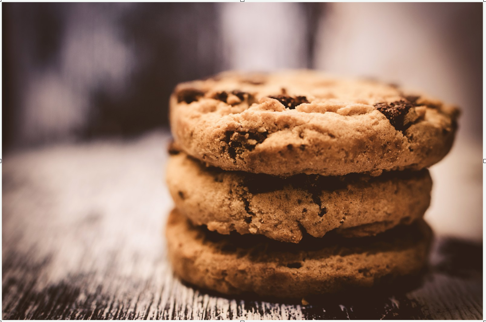
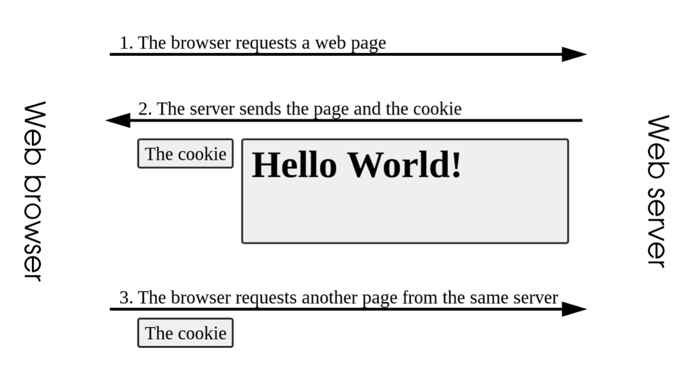

<h1 align="center">تمام چیزی که باید از کوکی‌های وب بدانید</h1>

    <figure align="center">
        
    </figure>

اصطلاح Cookie توسط برنامه‌نویسی به نام Lou Montulli ابداع شد. این اصطلاح از واژه‌ای به نام magic cookie مشتق شده است و در واقع بسته‌ای از داده است که برنامه‌ای ممکن است دریافت کرده و بدون تغییر ارسال کند و توسط برنامه‌نویسان یونیکس استفاده می‌شود. کلمه magic cookie نیز خود از کلمه fortune cookie نشات گرفته که در واقع کلوچه‌ای است که درون آن یک پیغام جاسازی شده است.
یک HTTP Cookie که به آن web cookie یا browser cookie نیز گفته می‌شود ، بخشی از دیتایی است که به حالت رشته‌ای (string) تبدیل شده و سرور (server) آن را به سمت مرورگر کاربر (client-browser) ارسال می‌کند. کوکی‌ها بخشی از پروتکل HTTP هستند که مشخصات آنها در مستندات RFC6265 آورده شده است. مرورگرها می‌توانند کوکی‌ها را ذخیره کرده و بعدا آنها را همراه با درخواست‌های بعدی (request) به سرور ارسال نمایند. معمولا یک کوکی برای مواردی از این قبیل استفاده می‌شود:

تشخیص اینکه آیا اینکه دو request متفاوت از سمت یک سرور یکسان آمده است یا خیر.
تشخیص اینکه کاربر لاگین شده است یا خیر
مشخصات کاربر
و ...

Cookieها ، اطلاعات داری وضعیت (stateful information) را برای پروتکل HTTP که بدون وضعیت (stateless) محسوب می‌شود ،
نگهداری می‌کنند.

Cookieها به صورت کلی برای سه منظور استفاده می‌شوند :

مدیریت جلسه‌ها (session) :
لاگین‌ها ، سبد‌های خرید ، امتیاز بازی‌ها یا باقی مواردی که سرور نیاز دارد به خاطر داشته باشد.
شخصی‌سازی :
ترجیحات کاربر ، تم و باقی تنظیمات
ردیابی (tracking) :
ذخیره و آنالیز رفتار کاربر

در گذشته از کوکی‌ها به عنوان ابزاری برای ذخیره اطلاعات سمت کاربر استفاده می‌شد. هر چند که در گذشته تنها راه ذخیره‌سازی دیتا سمت کاربر فقط کوکی‌ها بودند ، ولی امروزه در مرورگرهای مدرن ، توصیه می‌شود که از storage apiها استفاده نمایید. به دلیل اینکه کوکی‌ها همراه با هر request ارسال می‌شوند ، تاثیر بسیار بدی روی performance خواهند داشت ( مخصوصا روی دیتا کانکشن‌های موبایلی ) . apiهای مدرن برای ذخیره دیتا سمت کاربر ، Web Sotageها ( localStorage و sessionStorage ) و indexedDB هستند.

    <figure align="center">
        
    </figure>

#### ساخت Cookie :

بعد از دریافت یک HTTP Request ، سرور می‌تواند یک یا چند Set-Cookie header همراه با پاسخ (response) ارسال نماید. شما می‌توانید زمان انقضای کوکی یا دوره‌ای که بعد از آن ،کوکی نباید ارسال شود را تعیین نمایید. همچنین می‌توانید قید‌های دیگری از جمله domain و path را برای اعمال محدودیت‌های بیشتر روی کوکی‌ها تنظیم نمایید.
هدرهای Set-Cookie روی Http responseها ، کوکی‌ها را از سمت سرور به کاربر ارسال می‌نمایند. یک cookie ساده به شکل زیر تنظیم می‌شود:

Set-Cookie : <cookie-name>=<cookie-value>

توسط این خطوط ، سرور ارسال کننده header به مرورگر کاربر دستور می‌دهد که یک جفت کوکی را ذخیره کند:

HTTP/2.0 200 OKContent-Type: text/htmlSet-Cookie: yummy_cookie=chocoSet-Cookie: tasty_cookie=strawberry

سپس با هر رکوست دیگری از سمت مرورگر کلاینت به سرور ، مرورگر همه هدرهای ذخیره شده قبلی را توسط هدر کوکی (Cookie header) به سرور ارسال می کند.

GET /sample_page.html HTTP/2.0Host: www.example.orgCookie: yummy_cookie=choco; tasty_cookie=strawberry

#### تعیین طول عمر یک Cookie :

به ۲ روش می‌توان طول عمر یک Cookie را تعیین کرد.
کوکی‌های وابسته به جلسات (Session cookies که با نام‌های in_memory cookies ، transient cookie  یا non-persistent cookie نیز شناخته می‌شوند) با اتمام sessionها ، حذف (delete) می‌شوند (یعنی زمانی که مرورگر کاربر بسته شود). اینکه یک session چه زمانی به پایان می‌رسد ، توسط مرورگرها تعیین می‌شود و با توجه به اینکه بعضی از مرورگرها خاصیتی دارند به نام session restoring ، ممکن است session cookieها تا همیشه باقی بمانند. این نوع کوکی را می‌توان با تعیین نکردن مقدار expiration date ایجاد کرد.کوکی‌های دایم ، در زمانی که توسط Expire تعیین می‌شود یا بعد از مدت زمانی که توسط Max-Age تعیین می‌گردد ، حذف می‌شوند. برای مثال :
Set-Cookie: id=a3fWa; Expires=Thu, 31 Oct 2021 07:28:00 gmt;

وقتی شما عمر یک کوکی را با Expire و تاریخ مشخص می‌کنید ، این تاریخ وابسته به تاریخ سیستم کاربر است ، نه سرور.
هر دفعه که سایت شما ، کاربر را احراز هویت می‌کند ، می‌بایست session cookieها را دوباره ساخته و دوباره ارسال کند ، حتی اگر از قبل وجود داشته باشد. استفاده از این روش ، مانع حمله fixation attack می‌شود که در این نوع حمله ، حمله کننده (شخص ثالث) می‌تواند از session کاربر استفاده نماید.

#### محدودیت دسترسی یه کوکی‌ها

به وسیله دو روش می‌توانید اطمینان حاصل کنید که کوکی‌هایی که ارسال می‌کنید ، از روش امن ارسال شده و توسط نفرات غیرمجاز یا اسکریپت‌ها قابل دسترس نیستند :

Secure attribute
HttpOnly attribute

کوکی‌هایی که ویژگی Secure روی آنها فعال شده باشد ، فقط از طریق پروتکل‌ Https و به صورت requestهای رمزنگاری شده ارسال می‌شوند. این کوکی‌ها هرگز از طرق غیر ایمن HTTP (به جز برای localhost) ارسال نمی‌شوند و معنای آن این است که شخص ثالث (man-in-middle) به آسانی به آنها دسترسی نخواهند داشت.
سایت‌های غیرایمن (با پروتکل HTTP) ، نمی‌توانند کوکی‌هایی با ویژگی Secure ذخیره کنند. البته تصور نکنید که تنظیم کردن Secure باعث ایمنی کامل کوکی‌ها می‌شود. برای مثال اگر شخصی به هارد دیسک فیزیکی کاربر دسترسی داشته باشد ( یا بوسیله Javascript اگر ویژگی HttpOnly تنظیم نشده باشد) می‌تواند به کوکی‌ها دسترسی داشته و آنها را تغییر دهد.
کوکی‌ای که ویژگی HttpOnly روی آن فعال شده باشد ، توسط جاوا اسکریپت و Document.cookie api غیر قابل دسترسی خواهد بود. این کوکی فقط به سرور ارسال می‌شود. برای مثال کوکی‌هایی که سمت سرور مدیریت می‌شوند ، نیازی ندارند که توسط جاوااسکریپت قابل دسترس باشند و باید ویژگی HttpOnly روی آنها فعال شود. این اقدام احتیاطی ، به کاهش حملات اسکریپت بین سایتی (cross-site scripting - xss attack) کمک می کند. مثال :

Set-Cookie: id=a3fWa; Expires=Thu, 21 Oct 2021 07:28:00 GMT; Secure; HttpOnly

#### مشخص کردن محل ارسال کوکی‌ها

ویژگی Domain مشخص می‌کند که چه کسی (host) می‌تواند یک کوکی را دریافت کند. اگر ویژگی Domain تعیین نشده باشد ، مقدار پیش فرض ، همان host‌ای است که کوکی را ست کرده است البته بدون در نظر گرفتن subdomainها. اگر ویژگی Domain تنظیم شده باشد ، subdomainها نیز همیشه شاملش می‌شوند. پس تعیین مقدار Domain نسبت به نادیده گرفتن آن ، محدودیت کمتری ایجاد می‌کند. هر چند گاهی اوقات مفید خواهد بود. مثلا اینکه بخواهید اطلاعات کاربر بین تمامی subdomainها به اشتراک گذاشته شود.
برای مثال اگر در یک کوکی ، مقدار Domain را برابر با mozilla.org قرار دهید ، آن کوکی در subdomainهایی مثل developer.mozilla.org نیز در دسترس خواهند بود.

#### ویژگی Path

ویژگی Path مشخص می‌کند که در url درخواست کننده چه pathای باید وجود داشته باشد تا Cookie header به آن ارسال شود. کاراکتر %x2F که همان کاراکتر / است به عنوان directory seperator و subdirectory seperator در نظر گرفته می‌شود. برای مثال اگر شما مقدار Path را برابر با /docs قرار داده باشید ، مسیرهای زیر به کوکی دسترسی خواهند داشت :

/docs
/docs/
/docs/web
/docs/web/http

ولی مسیرهای زیر به کوکی دسترسی نخواهند داشت :

/
/docsets
/fr/docs

#### ویژگی SameSite

این ویژگی به سرور اجازه می‌دهد تا مشخص کند که کوکی‌ها با درخواست‌های بین سایتی (cross-site request) ارسال شوند یا خیر. این ویژگی محافظتی در برابر cross-site request forgery attacks (CSRF) است و سه مقدار می‌تواند داشته باشد : Strict Lax , None
با مقدار Strict، کوکی فقط به سایتی ارسال می شود که از آنجا نشات گرفته است. (یعنی فقط کوکی وقتی ارسال می‌شود که کاربر مرورگر را بازکرده و آدرس سایت اصلی که کوکی برای آن ایجاد شده است را مستقیما وارد کند). مقدار Lax نیز مشابه Strict است با این تفاوت که کوکی هنگامی ارسال می‌شود که کاربر به سایت اصلی هدایت شود. مثلا در یک سایت ثانویه لینکی وجود دارد که کاربر را به سایت اصلی هدایت کند. مقدار None نیز مشخص می‌کند که کوکی در هر دو حالت ارسال شود ولی فقط در بستری امن. یعنی اگر مقدار SameSite برابر با None قرار داده شود ، ویژگی Secure نیز باید فعال گردد در غیر اینصورت مشابه Lax عمل می‌نماید.

به عنوان مثال :

Set-Cookie: mykey=myvalue; SameSite=Strict

نکته : استاندارهای مربوط به SameSite اخیرا تغییر پیدا کرده است. برای اطلاعات بیشتر ، تطبیق‌پذیری مرورگرها با ورژن‌های مختلف را ، با این ویژگی بررسی کنید تا مطمن شوید که درست رفتار خواهند کرد :

اگر مقدار SameSite تعیین نگردد ، مقدار آن به صورت پیش فرض ، Lax خواهد بود.
اگر مقدار SameSite برابر با None تعیین گردید ، ویژگی Secure نیز باید فعال گردد.
از این بعد کوکی‌هایی که دامنه یکسان دارند ولی پروتکل‌های (schema) متفاوتی دارند (http و https) ، کوکی‌هایی با ریشه یکسان درنظر گرفته نمی‌شوند.

#### نام‌گذاری کوکی‌ها

مقدار کوکی‌ها می‌تواند شامل همه کاراکترهای ascii از ! تا ~ و همه حروف unicode از /u0021 تا /u007e باشد. البته به جز کاراکترهای , و ; و white-space. نام کوکی نیز از این قوانین پیروی می‌کند با این تفاوت که کاراکتر = را نیز نمی‌توانید استفاده
نمایید. در RFC 2965 محدودیت های بیشتری از این بابت برای کوکی‌ها ذکر شده است ولی توسط مرورگرها پیاده‌سازی نشده است. گاهی اوقات برای جفت نام-مقدار کوکی‌ها ، از واژه cookie crumb نیز استفاده می‌نمایند.

#### پیشوند‌های یک کوکی

به خاطر مکانیزم ذاتی cookie ، سرور نمی‌تواند مطمن شود که آیا cookie از یک منبع امن نشات گرفته است یا حتی اینکه مطمن شود منشا اصلی cookie کجاست. یک برنامه کاربردی (application) نامطمن ، در یک subdomain می‌تواند کوکی‌ای با domainای ست کند که باعث شود آن کوکی در همه subdomainها در دسترس باشد. این مکانیزم در حمله session fixation attack کاربرد دارد. به عنوان روش دفاعی ، می‌توانید از پیشوند‌ها برای اثبات حقایقی در مورد کوکی‌ها استفاده نمایید. ۲ پیشوند موجود است :

پیشوند \_\_Host-

اگر نام کوکی دارای این پیشوند باشد، تنها در صورتی در هدر Set-Cookie پذیرفته می‌شود که ویژگی Secure روی آن فعال شده باشد ، از مبدأ امن ارسال شده باشد (HTTPS) ، ویژگی Domain نداشته باشد و ویژگی Path روی / تنظیم شده باشد. به این ترتیب، این کوکی‌ها روی دامنه قفل می‌شوند. (domain-locked)

پیشوند \_\_Secure-

اگر نام کوکی دارای این پیشوند باشد، تنها در صورتی در هدر Set-Cookie پذیرفته می شود که ویژگی Secure در آن فعال شده باشد و از یک منبع امن ارسال شده باشد. این پیشوند ضعیفتر از پیشوند \_\_Host- است.

مرورگرها ، کوکی‌هایی که دارای این پشوند‌ها بوده ولی قوانین آنها را رعایت نکنند ، قبول نمی‌کنند. توجه داشته باشید که این روش تضمین می‌کند که کوکی‌های ایجاد شده با پیشوندها برای هر subdomain یا به همان subdomain محدود شده یا به طور کامل نادیده گرفته شوند. از آنجا که برنامه‌های سمت سرور برای اینکه چک کنند کاربر احراز هویت شده است یا خیر ، یا یک توکن CSRF به درستی ست شده است یا خیر ، دنبال نام کوکی خاصی می‌گردند ، استفاده از پیشوند راه مناسبی برای مقابله با حملات session fixation می‌باشند. در اپلیکیشن‌های سروری ، برنامه‌های وب باید تمام نام یک کوکی به همراه پیشوند آنها را چک کنند. مرورگرها پیش از ارسال این کوکی‌ها ، پیشوند آن را حذف نمی‌کنند.

#### دسترسی Javascript به کوکی‌ها از طریق Document.cookie

از طریق جاوا اسکریپت و بوسیله Document.cookie می‌توانید کوکی جدید ایجاد کنید. همچنین از طریق Javascript می‌توانید به کوکی‌هایی که ویژگی HttpOnly روی آنها فعال نشده باشد ، دسترسی پیدا کنید. مثال :

document.cookie = "yummy_cookie=choco";document.cookie = "tasty_cookie=strawberry";
console.log(document.cookie);// logs "yummy_cookie=choco; tasty_cookie=strawberry"

ویژگی HttpOnly روی کوکی‌هایی که با Javascript ساخته می‌شوند ، نمی‌تواند فعال باشد.
لطفا بخش پایین را به دقت مطالعه کنید. کوکی‌هایی که توسط Javascript می‌توان به آنها دسترسی داشت ، در مقابله حملات XSS آسیب پذیر بوده و ممکن است به سرقت بروند.

#### امنیت

توجه داشته باشید وقتی اطلاعاتی را در کوکی ذخیره می‌کنید ، کاربر نهایی می‌تواند این دیتاها را ببیند و آنها را تغییر دهد. با توجه به نوع اپلیکیشن ، می‌توانید از شناسه‌های غیر واضح استفاده کنید یا به دنبال مکانیزم‌های جایگزین مانند json web token برای احراز‌هویت باشید.

راه‌های کاهش حملات از طریق کوکی‌ها :

ویژگی HttpOnly روی کوکی‌ها فعال شود تا از طریق JavaScript نتوان به آنها دسترسی داست.
کوکی‌هایی که برای اطلاعات حساس استفاده می‌شوند (مانند اطلاعات هویتی) ، باید طول عمر کوتاهی داشته و مقدار SameSite آن برابر با Lax یا Strict باشد. در مرورگرهایی که از SameSite پشتیبانی می‌کنند ، این ویژگی باعث می‌شود که کوکی‌های احراز هویت در درخواست‌های cross-site ارسال نشوند.

#### کوکی های شخص ثالث

یک کوکی ، با یک domain و پروتکل خاص (مانند http یا https) مرتبط است و همچنین در صورت تنظیم ویژگی Domain ممکن است با subdomainها نیز مرتبط شود. اگر domain و پروتکل cookie با صفحه فعلی مطابقت داشته باشد، منشا کوکی همان سایت در نظر گرفته می شود. در این حالت اصطلاحا به آن ، کوکی اول شخص (first-party cookie) گفته می‌شود.
اگر domain و پروتکل کوکی با صفحه فعلی تفاوت داشته باشد ، منشا کوکی ، آن سایت در نظر گرفته نشده و اصطلاحا به آن کوکی شخص ثالث (third-party cookie) گفته می‌شود. در حالی که سرور میزبانی کننده صفحات ، کوکی‌های اول شخص را ست می‌کنند ، صفحه ممکن است حاوی تصاویر یا سایر اجزای ذخیره شده در سرورهای دامنه های دیگر (به عنوان مثال، بنرهای تبلیغاتی) باشد که ممکن است کوکی های شخص ثالث را تنظیم کنند. اینها عمدتاً برای تبلیغات و ردیابی در سراسر وب استفاده می شوند. به عنوان مثال، انواع کوکی های استفاده شده توسط گوگل. یک سرور شخص ثالث می‌تواند تاریخچه‌ای از فعالیت‌ها و عادت‌های کاربر هنگام دسترسی به سایت‌های مختلف از طریق یک مرورگر را ، ایجاد کرده و نگهداری نماید. فایرفاکس به‌طور پیش‌فرض، کوکی‌های شخص ثالث را که حاوی ردیاب‌ها هستند، مسدود می‌کند. کوکی‌های شخص ثالث ( یا به طور اختصار کوکی‌های ردیابی ) ، ممکن است توسط سایر تنظیمات مروگر یا افزونه‌ها نیز مسدود شوند. مسدودسازی کوکی‌ها باعث می‌شود بعضی از کامپوننت‌های شخص ثالث مانند ویجت‌های شبکه‌های اجتماعی نیز به درستی کار نکنند. سرورها می‌توانند (باید) مقدار SameSite برای کوکی‌ها را تعیین کرده تا مشخص کنند که کوکی‌ها برای سایت‌های سوم شخص ارسال گردنند یا خیر.

مرورگرهای گوناگون سیاست‌های متفاوتی را در قبال کوکی‌های شخص ثالث پیش گرفته‌اند ولی گوگل قصد دارد از سال ۲۰۲۴ به صورت پیش ‌فرض ، این نوع کوکی‌ها را بلاک کند.

مقررات مربوط به کوکی ها

قوانین یا مقرراتی که استفاده از کوکی ها را پوشش می دهد عبارتند از:

The General Data Privacy Regulation (GDPR) in the European Union
The ePrivacy Directive in the EU
The California Consumer Privacy Act

این مقررات دامنه جهانی دارند. آنها برای هر سایتی در وب جهانی که کاربران این حوزه های قضایی به آن دسترسی دارند ، اعمال می شوند (اتحادیه اروپا و کالیفرنیا، با این اخطار که قانون کالیفرنیا فقط برای نهادهایی با درآمد ناخالص بیش از 25 میلیون دلار اعمال می شود). این مقررات شامل الزاماتی از قبیل موارد زیر هستند:

اطلاع به کاربران از اینکه سایت شما از کوکی‌ها استفاده می‌نماید.
امکان انصراف کاربران از دریافت همه یا برخی از کوکی‌ها.
اجازه دادن به کاربران برای استفاده از بخش عمده خدمات شما بدون دریافت کوکی.

ممکن است مقررات دیگری بر استفاده از کوکی ها در محل زندگی شما حاکم باشد. آگاهی و رعایت این مقررات بر عهده شماست. شرکت‌هایی وجود دارند که کد «بنر کوکی» (cookie banner) را ارائه می‌دهند که به شما کمک می‌کند تا از این مقررات پیروی کنید.

#### دیوار کوکی ( Cookie Wall )

یک دیوار کوکی ، پاپ‌آپی است که به کاربران یک سایت اطلاع می‌دهد که سایتی که آنها قصد بازدید از آن را دارند ، از کوکی‌ها استفاده می‌کند. این پاپ‌آپ‌ها هیچ دکمه مخالفتی (reject) ندارند و سایت ، بدون آنها قابل دسترس نخواهد بود.

#### سوپر کوکی‌ها ( Super Cookies )

سوپرکوکی ، کوکی‌ای است که مقدار Domain آن روی یکی از top-level domains مانند .com تنظیم شده باشد. دقت کنید که در این نوع کوکی برخلاف کوکی معمولی ، نام domain سایت خاصی ذکر نشده است.سوپرکوکی‌ها به صورت ذاتی مستعد بسیاری از مشکلات امنیتی هستند به خاطر همین توسط مرورگرها بلاک می‌شوند. اگر این نوع کوکی‌ها توسط کاربر از حالت بلاک خارج شوند ، هکری که کنترل سایتی را بر عهده دارد می‌تواند کوکی‌ای مثلا با مقدار دامین .com برای مرورگر کاربر ارسال کند تا درخواست‌های بعدی کاربر را تحت تاثیر قرار دهد و از آنها برای جعل اطلاعات کاربر یا لاگین‌های فیک استفاده نماید.

#### تعداد و ظرفیت کوکی‌ها

ظرفیت ذخیره‌سازی کوکی‌ها و همچنین تعداد کوکی‌هایی که به ازای هر دامنه می‌توانند ذخیره شوند ، به مرورگری که کاربر از آن استفاده می‌کند بستگی دارد ولی به طور معمول توصیه می‌شود که تعداد کوکی‌ها بیشتر از ۲۰ عدد نشده و مجموع حجم آنها نیز نهایتا ۴ مگابایت باشد.

#### سایر روش‌های ذخیره اطلاعات در مرورگرها

راه دیگری برای ذخیره دیتاها در مرورگرها ، استفاده از Web Storage api است.ویژگی‌های window.sessionStorage و window.localStorage ، مشابه کوکی‌های دایم یا وابسته به session هستند ولی نسبت به کوکی‌ها ظرفیت بیشتری داشته و هرگز به سرور ارسال نمی‌شوند. دیتاهایی با حجم بیشتر و ساخت یافته‌تر می‌توانند از طریق IndexedDB API یا کتابخانه‌هایی که روی آن ایجاد شده است ، دخیره گردند.

#### کوکی‌های Zombie

تکنیک‌هایی وجود دارد که می‌توان کوکی‌های حذف شده را پس حذف بازیابی کرده و دوباره ایجاد نمود. به این کوکی‌ها Zombie می‌گویند. این تکنیک‌ها که اصول حریم خصوصی کاربر و کنترل کاربر را نقض می‌کنند، ممکن است قوانین حریم خصوصی داده‌ها را نیز نقض کنند و می‌توانند وب‌سایتی را که از آنها استفاده می‌کند در معرض مسئولیت قانونی قرار دهند.
در واقع نحوه عملکرد این کوکی‌ها بدین صورت است که وب‌سایتی که کوکی‌ها را برای کاربر ارسال می‌کند ، آنها را در محل مخفی‌ای خارج از محلی که به صورت پیش فرض برای نگهداری کوکی‌ها درنظر گرفته شده است ، ذخیره می‌کند مانند Flash Local shared object یا HTML5 Web storage یا محل‌های دیگری سمت کلاینت یا حتی سرور. وقتی این کوکی‌ها پاک‌شوند ، نبود آنها تشخیص داده شده و با این داده‌های مخفی ، دوباره ساخته خواهند شد.

---

منبع:
https://developer.mozilla.org/en-US/docs/Web/HTTP/Cookies
https://en.wikipedia.org/wiki/HTTP_cookie
https://www.rfc-editor.org/rfc/rfc6265
https://docs.devexpress.com/AspNet/11912/common-concepts/cookies-support

