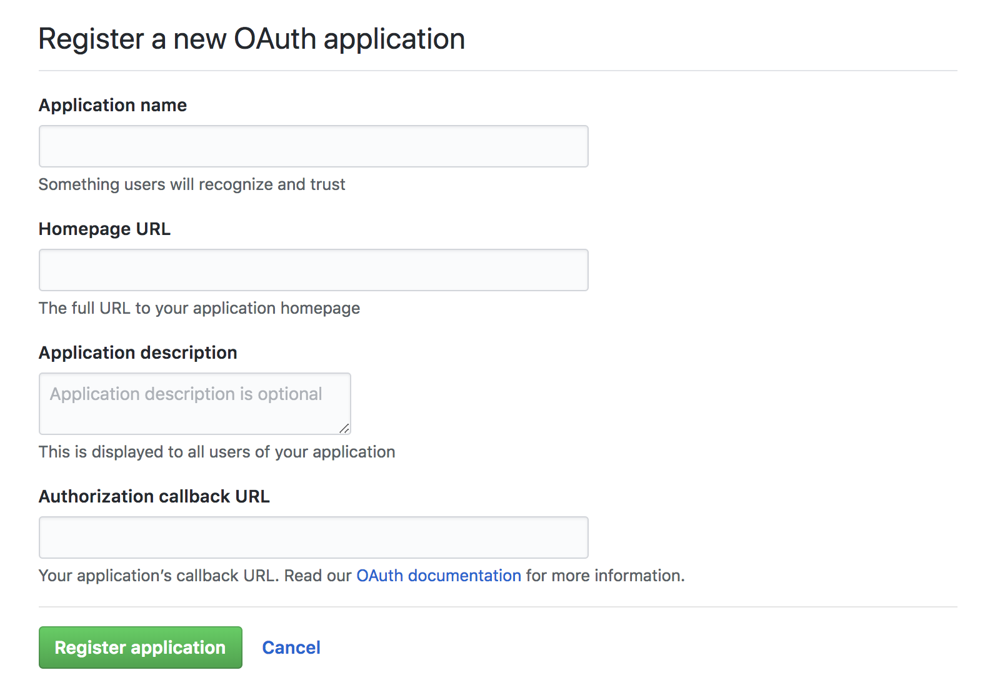
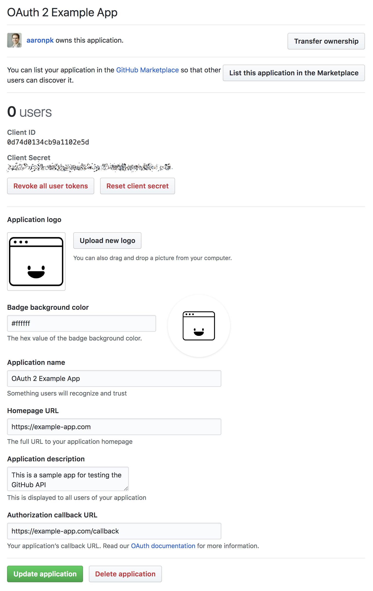

<h1 align="center">Create an Application</h1>

Before we can begin, we’ll need to create an application on GitHub in order to get a client ID and client secret.

On GitHub.com, from the “Settings” page, click on the “Developer Settings” link in the sidebar. You will end up on https://github.com/settings/developers. From there, click “New OAuth App” and you will be presented with a short form, as shown below.

Fill out the required information, including the callback URL. If you are developing an application locally, you’ll have to use a local address for the callback URL. Since GitHub allows only one registered callback URL per application, it is useful to create two applications, one for development, and a separate one for production.

    <figure align="center">
        
        <figcaption style="font-size:14px;color:#bbb">Register a new OAuth application on GitHub</figcaption>
    </figure>

After completing this form, you’ll be taken to a page where you can see the client ID and secret issued to your application, shown below.

The client ID is considered public information, and is used to build authorization URLs, or can be included in the JavaScript source code of a web page. The client secret **must** be kept confidential. Don’t commit this to your git repository or include it in any JavaScript files!

    <figure align="center">
        
        <figcaption style="font-size:14px;color:#bbb">GitHub application has been created</figcaption>
    </figure>

