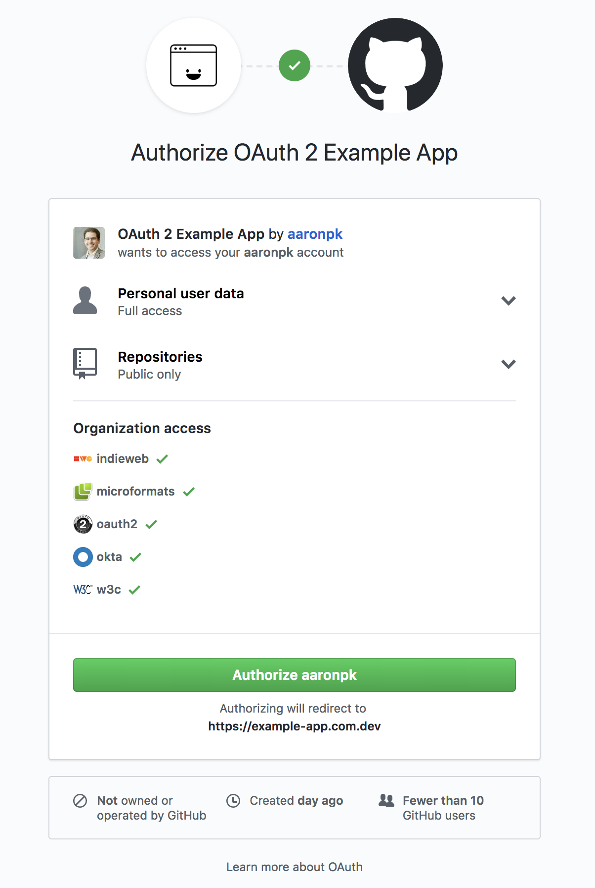

<h1 align="center">Authorization Request</h1>

Now that we have the necessary variables set up, let’s start the OAuth process.

The first thing we’ll have people do is visit this page with `?action=login in` the query string to kick off the process.

Note the scopes we are asking for in this request include `user` and `public_repo`. This means the app will be able to read the user profile information as well as have access to public repos.

```
// Start the login process by sending the user
// to GitHub's authorization page
if(isset($_GET['action']) && $_GET['action'] == 'login') {
  unset($_SESSION['access_token']);

  // Generate a random hash and store in the session
  $_SESSION['state'] = bin2hex(random_bytes(16));

  $params = array(
    'response_type' => 'code',
    'client_id' => $githubClientID,
    'redirect_uri' => $baseURL,
    'scope' => 'user public_repo',
    'state' => $_SESSION['state']
  );

  // Redirect the user to GitHub's authorization page
  header('Location: '.$authorizeURL.'?'.http_build_query($params));
  die();
}
```

It’s important to generate a “state” parameter to use to protect the client from CSRF attacks. This is a random string that the client generates and stores in the session. GitHub will redirect the user back here with the state in the query string, so we can verify it matches the state stored in the session before exchanging the authorization code for an access token.

We build up the authorization URL and then send the user there. The URL contains our public client ID, the redirect URL which we previously registered with GitHub, the scope we’re requesting, and the “state” parameter.

<p align="center"  style="width:100%">
    <figure align="center">
        
        <figcaption style="font-size:14px;color:#bbb">GitHub’s Authorization Request</figcaption>
    </figure>
</p>

At this point, the user will see GitHub’s OAuth authorization prompt, illustrated above.

When the user approves the request, they will be redirected back to our page with `code` and `state` parameters in the request. The next step is to exchange the authorization code for an access token.
