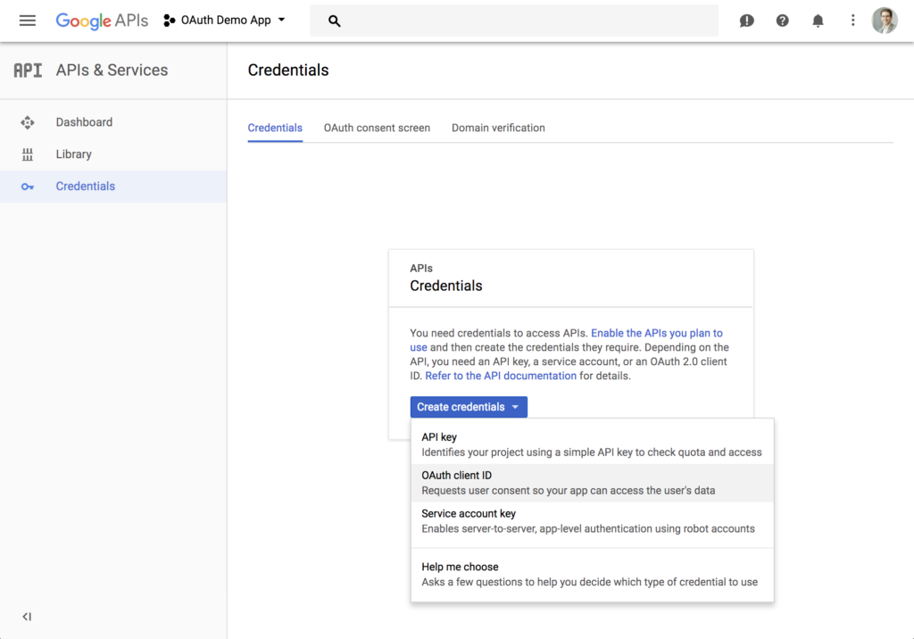

<h1 align="center">Create an Application</h1>

Before we can begin, we’ll need to create an application in the Google API Console in order to get a client ID and client secret, and register the redirect URL.

Visit https://console.developers.google.com/ and create a new project. You’ll also need to create OAuth 2.0 credentials for the project since Google does not do that automatically. From the sidebar, click the **Credentials** tab, then click **Create credentials** and choose **OAuth client ID** from the dropdown.

    <figure align="center">
        
        <figcaption style="font-size:14px;color:#bbb">Create Credentials for your App on the Google API Console</figcaption>
    </figure>

The Google Console will prompt for some information about your application such as the product name, a home page, and a logo. On the next page, select **Web application** type, and enter the redirect URL where the script we’ll build next will live. You will then receive a client ID and secret.

[Previous](https://github.com/alithecodeguy/articles/blob/main/OAuth/OAuth%202.0%20Simplified/03%20Signing%20in%20with%20Google/SigningInWithGoogle_en.md "Previous")
/
[Next](https://github.com/alithecodeguy/articles/blob/main/OAuth/OAuth%202.0%20Simplified/03%20Signing%20in%20with%20Google/02%20Setting%20up%20the%20Environment/SettingUpTheEnvironment_en.md "Next")
