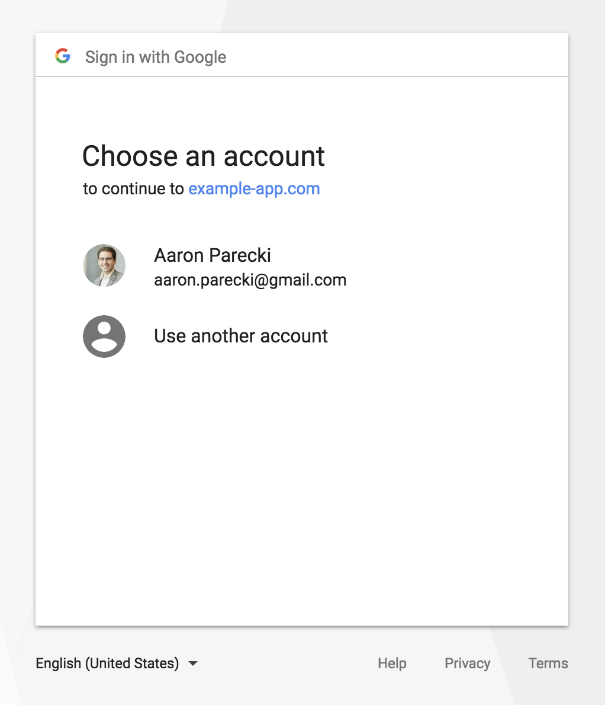

<h1 align="center">Authorization Request</h1>

Now that we have the necessary variables set up, let’s start the OAuth process.

The first thing we’ll have people do is visit this page with `?action=login` in the query string to kick off the process.

Note that scopes in this request are now OpenID Connect scopes, “openid email”, indicating that we are not requesting access to the user’s Google data, just wanting to know who they are.

Also note that we are using the `response_type=code` parameter to indicate that we want Google to return an authorization code that we’ll exchange for the id_token later.

```
// Start the login process by sending the user
// to Google's authorization page
if(isset($_GET['action']) && $_GET['action'] == 'login') {
  unset($_SESSION['user_id']);

  // Generate a random string and store in the session
  $_SESSION['state'] = bin2hex(random_bytes(16));

  $params = array(
    'response_type' => 'code',
    'client_id' => $googleClientID,
    'redirect_uri' => $baseURL,
    'scope' => 'openid email',
    'state' => $_SESSION['state']
  );

  // Redirect the user to Google's authorization page
  header('Location: '.$authorizeURL.'?'.http_build_query($params));
  die();
}
```

It’s important to generate a “state” parameter to use to protect the client from CSRF attacks. This is a random string that the client generates and stores in the session. Our app will verify that that state parameter in the redirect from Google matches the one that was created at the start of the flow.

We build up an authorization URL and then send the user there. The URL contains our public client ID, the redirect URL which we previously registered with Google, the scope we’re requesting, and the “state” parameter.

<p align="center"  style="width:100%">
    <figure align="center">
        
        <figcaption style="font-size:14px;color:#bbb">Google’s Authorization Request</figcaption>
    </figure>
</p>

If the user is already logged in to Google, they’ll see an account chooser screen as shown above asking them to choose an existing account or use a different account. Notice that this screen does not look like a typical OAuth screen, because the user isn’t granting any permissions to the application, it’s just trying to identify them.

When the user selects an account, they will be redirected back to our page with `code` and `state` parameters in the request. The next step is to exchange the authorization code for an access token at the Google API.

[Previous](https://github.com/alithecodeguy/articles/blob/main/OAuth/OAuth%202.0%20Simplified/03%20Signing%20in%20with%20Google/02%20Setting%20up%20the%20Environment/SettingUpTheEnvironment_en.md "Previous")
/
[Next](https://github.com/alithecodeguy/articles/blob/main/OAuth/OAuth%202.0%20Simplified/03%20Signing%20in%20with%20Google/04%20Getting%20an%20ID%20Token/GettingAnIDToken_en.md "Next")
