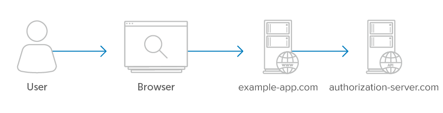

<h1 align="center">Server-Side Apps</h1>

Server-side apps are the most common type of application encountered when dealing with OAuth servers. These apps run on a web server where the source code of the application is not available to the public, so they can maintain the confidentiality of their client secret.

The diagram below illustrates a typical example where the user interacts with their browser which is communicating with the client. The client and the API server have a separate secure communications channel between them. The user’s browser never makes a request directly to the API server, everything goes through the client first.

    <figure align="center">
        
        <figcaption style="font-size:14px;color:#bbb">The app’s server communicates with the API</figcaption>
    </figure>

Server-side apps use the `authorization_code` grant type. In this flow, after the user authorizes the application, the application receives an “authorization code” which it can then exchange for an access token.

- Authorization Code Flow
- Example Flow
- Possible Errors
- User Experience Considerations
- Security Considerations

[Previous](https://github.com/alithecodeguy/articles/blob/main/OAuth/OAuth%202.0%20Simplified/03%20Signing%20in%20with%20Google/SigningInWithGoogle_en.md "Previous")
/
[Next](https://github.com/alithecodeguy/articles/blob/main/OAuth/OAuth%202.0%20Simplified/04%20Server-Side%20Apps/01%20Authorization%20Code%20Flow/AuthorizationCodeGrant_en.md "Next")
