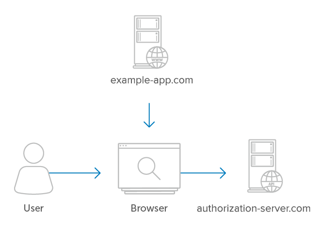

<h1 align="center">Single-Page Apps</h1>

Single-page apps (also known as browser-based apps) run entirely in the browser after loading the JavaScript and HTML source code from a web page. Since the entire source is available to the browser, they cannot maintain the confidentiality of a client secret, so a secret is not used for these apps. Because they can’t use a client secret, the best option is to use the PKCE extension to protect the authorization code in the redirect. This is similar to the solution for mobile apps which also can’t use a client secret.

> ### Deprecation Notice
>
> A common historical pattern for single-page apps was to use the Implicit flow to receive an access token in the redirect without the intermediate authorization code exchange step. This has a number of security issues as described Implicit Flow and should no longer be used. Please see https://oauth.net/2/browser-based-apps/ for more details.

The diagram below illustrates an example where the user interacts with their browser, which in turn makes API requests directly to the service. After first downloading the Javascript and HTML source code from the client, the browser then makes direct API requests to the service. In this case, the app’s server never makes API requests to the service, since everything is handled directly in the browser.

<p align="center"  style="width:100%">
    <figure align="center">
        
        <figcaption style="font-size:14px;color:#bbb">The user’s browser communicates directly with the API server</figcaption>
    </figure>
</p>

## Authorization

The authorization code is a temporary code that the client will exchange for an access token. The code itself is obtained from the authorization server where the user gets a chance to see what the information the client is requesting, and approve or deny the request.

The first step of the web flow is to request authorization from the user. This is accomplished by creating an authorization request link for the user to click on.

The authorization URL is usually in a format such as:

```
https://authorization-server.com/oauth/authorize
  ?client_id=a17c21ed
  &response_type=code
  &state=5ca75bd30
  &redirect_uri=https%3A%2F%2Fexample-app.com%2Fauth
```

After the user visits the authorization page, the service shows the user an explanation of the request, including application name, scope, etc. If the user clicks “approve”, the server will redirect back to the website, with an authorization code and the state value in the URL query string.

## Authorization Grant Parameters

The following parameters are used to make the authorization request.

#### response_type

`response_type` is set to code indicating that you want an authorization code as the response.

#### client_id

The `client_id` is the identifier for your app. You will have received a client_id when first registering your app with the service.

#### redirect_uri (optional)

The `redirect_uri` is optional in the spec, but some services require it. This is the URL to which you want the user to be redirected after the authorization is complete. This must match the redirect URL that you have previously registered with the service.

#### scope (optional)

Include one or more scope values to request additional levels of access. The values will depend on the particular service.

#### state (recommended)

The state parameter serves two functions. When the user is redirected back to your app, whatever value you include as the state will also be included in the redirect. This gives your app a chance to persist data between the user being directed to the authorization server and back again, such as using the state parameter as a session key. This may be used to indicate what action in the app to perform after authorization is complete, for example, indicating which of your app’s pages to redirect to after authorization. This also serves as a CSRF protection mechanism.

Note that the lack of using a client secret means that using the state parameter is even more important for single-page apps.

## Example Flow

The following step-by-step example illustrates using the authorization grant type for single-page apps.

#### The app initiates the authorization request

The app initiates the flow by crafting a URL containing ID, and optionally scope and state. The app can put this into an `<a href=""> tag`.

```
<a href="https://authorization-server.com/authorize?response_type=code
     &client_id=mRkZGFjM&state=TY2OTZhZGFk">Connect Your Account</a>
```

#### The user approves the request

Upon being directed to the auth server, the user sees the authorization request.

<p align="center"  style="width:100%">
    <figure align="center">
        
        <figcaption style="font-size:14px;color:#bbb">Example Authorization Request<figcaption>
    </figure>
</p>

After the user is taken to the service and sees the request, they will either allow or deny the request. If they allow the request, they will be redirected back to the redirect URL specified along with an authorization code in the query string. The app then needs to exchange this authorization code for an access token.

```
https://example-app.com/cb?code=Yzk5ZDczMzRlNDEwY&state=TY2OTZhZGFk
```

If you include a “state” parameter in the initial authorization URL, the service will return it to you after the user authorizes your app. Your app should compare the state with the state it created in the initial request. This helps ensure that you only exchange authorization codes that you requested, preventing attackers from redirecting to your callback URL with arbitrary or stolen authorization codes.

## Exchange the authorization code for an access token

To exchange the authorization code for an access token, the app makes a POST request to the service’s token endpoint. The request will have the following parameters.

#### grant_type (required)

The `grant_type` parameter must be set to “`authorization_code`“.

#### code (required)

This parameter is for the authorization code received from the authorization server which will be in the query string parameter “code” in this request.

#### redirect_uri (possibly required)

If the redirect URL was included in the initial authorization request, it must be included in the token request as well, and must be identical. Some services support registering multiple redirect URLs, and some require the redirect URL to be specified on each request. Check the service’s documentation for the specifics.

#### Client Identification (required)

Despite the client secret not being used in this flow, the request requires sending the client ID to identify the application making the request. This means the client must include the client ID as a POST body parameter rather than using HTTP Basic Authentication like it can when including the client secret as well.

```
POST /oauth/token HTTP/1.1
  Host: authorization-endpoint.com
  grant_type=code
  &code=Yzk5ZDczMzRlNDEwY
  &redirect_uri=https://example-app.com/cb
  &client_id=mRkZGFjM
```

## Implicit Flow

Some services use the alternative Implicit Flow for single-page apps, rather than allow the app to use the Authorization Code flow with no secret.

The Implicit Flow bypasses the code exchange step, and instead the access token is returned in the query string fragment to the client immediately.

In practice, there are only very limited cases in which this is necessary. Several major implementations (Keycloak, Deutsche Telekom, Smart Health IT) have chosen to avoid the Implicit Flow completely and use the Authorization Code flow instead.

In order for a single-page app to use the Authorization Code flow, it must be able to make a POST request to the authorization server. This means if the authorization server is on a different domain, the server will need to support the appropriate CORS headers. If supporting CORS headers is not an option, then the service may use the Implicit Flow instead.

In any case, with both the Implicit Flow as well as the Authorization Code Flow with no secret, the server must require registration of the redirect URL in order to maintain the security of the flow.

## Security Considerations

The only way the authorization code grant with no client secret can be secure is by using the “state” parameter and restricting the redirect URL to trusted clients. Since the secret is not used, there is no way to verify the identity of the client other than by using a registered redirect URL. This is why you need to pre-register your redirect URL with the OAuth 2.0 service.

[Previous](https: "Previous")
/
[Next](https: "Next")
