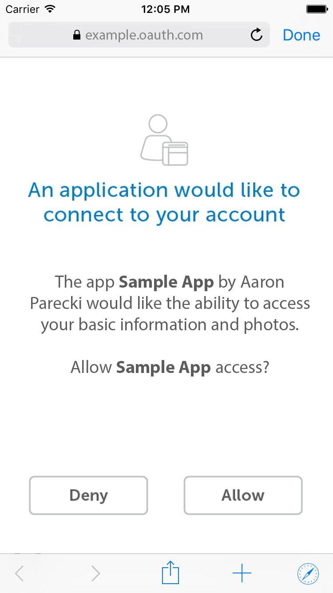

<h1 align="center">Mobile and Native Apps</h1>

Create a “Log in” button that will open a secure web browser within the app (`ASWebAuthenticationSession` or `SFSafariViewController` on iOS, and “Custom Tabs” on Android). You’ll use the same parameters for the authorization request as described in Server-Side Apps including the PKCE parameters.

The resulting redirect will include the temporary authorization code which the app will exchange for an access token from its native code.

## Example

In this example we will walk through a simple iPhone application that obtains authorization to access a fictional API.

## Initiate the authorization request

To begin the authorization process, the app should have a “sign in” button. The link should be constructed as a full URL to the service’s authorization endpoint.

The client first creates what is known as a PKCE `“code verifier“`. This is a cryptographically random string using the characters `A-Z`,` a-z`, `0-9`, and the punctuation characters `-._~` (`hyphen`, `period`, `underscore`, and `tilde`), between 43 and 128 characters long.

Once the app has generated the code verifier, it uses that to create the `code challenge`. The code challenge is a Base64-URL-encoded string of the SHA256 hash of the code verifier. This hashed value is sent in the authorization request, so that the original random string is never exposed to anything outside the app.

The authorization request parameters are used to create the authorization URL, such as:

```
https://authorization-server.com/authorize
?client_id=eKNjzFFjH9A1ysYd
&response_type=code
&redirect_uri=com.example.app://auth
&state=1234zyx
&scope=photos
&code_challenge=hKpKupTM381pE10yfQiorMxXarRKAHRhTfH_xkGf7U4
&code_challenge_method=S256
```

Note in this case the custom scheme of the redirect URL. Both iOS and Android provide the ability for apps to register custom URL schemes which can be used as the redirect URL. This is also sometimes called “deep linking” in the platform’s documentation. Both platforms also allow the app to register itself to be launched when a matching URL pattern is visited (“Universal Links” on iOS and “App Links” on Android). Both methods provide approximately the same experience when using an app, but the “Universal/App Links” method provides better fallback behavior when the URL is visited if the user doesn’t have the app installed. The “Universal Links” and “App Links” methods are generally considered more modern and are probably what you should use going forward.

When the user taps the “Sign In” button, the app should open the authorization URL in a secure in-app browser (`ASWebAuthenticationSession` on iOS, or a “Custom Tab” on Android). Using an embedded `WebView` window within the app is considered extremely dangerous, as this provides the user no guarantee they are looking at the service’s own website and so is an easy source of a phishing attack. The embedded web view also provides a worse user experience since it does not share system cookies and the user will always have to enter their credentials. By using the platform’s secure browser APIs which share cookies with the system browser, you have the advantage of the user potentially already being signed in to the service as well and not needing to enter their credentials every time.

## The user approves the request

Upon being directed to the auth server, the user sees an authorization request shown below.

<p align="center"  style="width:100%">
    <figure align="center">
        
        <figcaption style="font-size:14px;color:#bbb">An embedded ASWebAuthenticationSession. The “Done” button in the top right corner collapses the view and returns the user to the app.<figcaption>
    </figure>
</p>

## The service redirects the user back to the app

When the user finishes signing in, the service will redirect back to your app’s redirect URL which will cause the secure browser API to send the resulting URL to your app. The `Location` header from the redirect will look something like the following, which will be passed to your app.

```
com.example.app://auth://auth?state=1234zyx
&code=lS0KgilpRsT07qT_iMOg9bBSaWqODC1g061nSLsa8gV2GYtyynB6A
```

Your app should then parse out the state value and authorization code from the URL, verify the state matches the value it set, and then exchange the authorization code for an access token.

### Exchange the authorization code for an access token

To exchange the authorization code for an access token, the app makes a POST request to the service’s token endpoint. This happens from the app’s native code rather than from within the browser, since that’s where the PKCE code_verifier was stored. The request will have the following parameters.

#### grant_type (required)

The `grant_type` parameter must be set to `“authorization_code“`.

#### code (required)

This parameter is for the authorization code received from the authorization server which will be in the query string parameter “code” in this request.

#### redirect_uri (possibly required)

If the redirect URL was included in the initial authorization request, it must be included in the token request as well, and must be identical. Some services support registering multiple redirect URLs, and some require the redirect URL to be specified on each request. Check the service’s documentation for the specifics.

#### code_verifier (required)

Since the client included a `code_challenge` parameter in the initial request, it must now prove it has the secret used to generate the hash by sending it in the POST request. This is the plaintext string that was used to calculate the hash that was previously sent in the `code_challenge` parameter.

#### Client Identification (required)

Despite the client secret not being used in this flow, the request requires sending the client ID to identify the application making the request. This means the client must include the client ID as a POST body parameter rather than using HTTP Basic Authentication like it can when including the client secret as well.

```
POST /oauth/token HTTP/1.1
Host: authorization-endpoint.com

grant_type=code
&code=Yzk5ZDczMzRlNDEwY
&redirect_uri=com.example.app://auth
&client_id=eKNjzFFjH9A1ysYd
&code_verifier=Th7UHJdLswIYQxwSg29DbK1a_d9o41uNMTRmuH0PM8zyoMAQ
```

[Previous](https: "Previous")
/
[Next](https: "Next")
