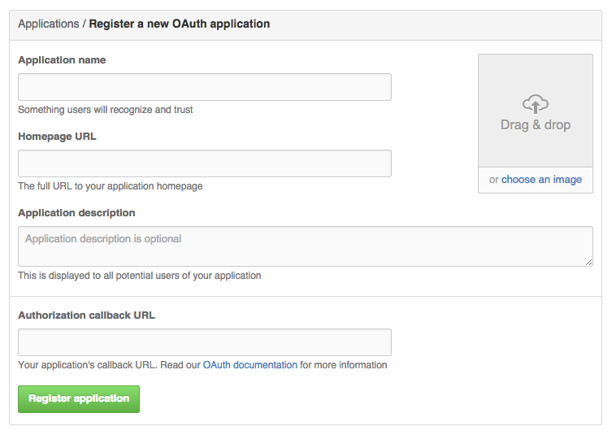
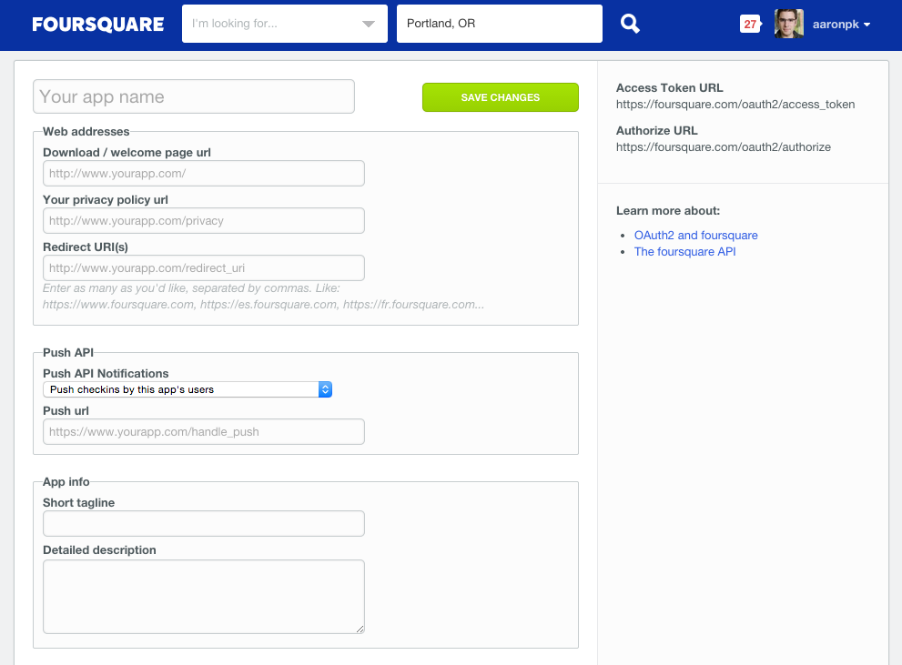
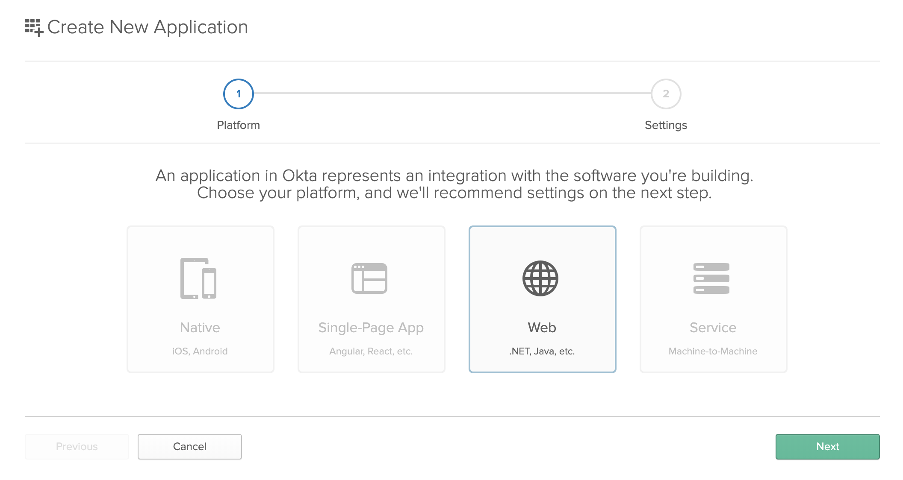

<h1 align="center">Registering a New Application</h1>

When a developer comes to your website, they will need a way to create a new application and obtain credentials. Typically you will have them create a developer account, or create an account on behalf of their organization, before they can create an application.

While the OAuth 2.0 spec doesn’t require you to collect any application information in particular before granting credentials, most services collect basic information about an app, such as the app name and an icon, before issuing the `client_id` and `client_secret`. It is, however, important that you require the developer to register one or more redirect URLs for the application for security purposes. This is explained in more detail in Redirect URLs.

Typically services collect information about an application such as:

- Application name
- An icon for the application
- URL to the application’s home page
- A short description of the application
- A link to the application’s privacy policy
- A list of redirect URLs

Below is GitHub’s interface for registering an application. In it, they collect the application name, home page URL, the callback URL, and an optional description.

    <figure align="center">
        
        <figcaption style="font-size:14px;color:#bbb">Creating a new application on Github<figcaption>
    </figure>

It is a good idea to specify to your developers whether the information you are collecting from them will be displayed to end users, or whether it is for internal use only.

Foursquare’s application registration page asks for similar information, but they additionally ask for a short tagline and a privacy policy URL. These are displayed to the user in the authorization prompt.

    <figure align="center">
        
        <figcaption style="font-size:14px;color:#bbb">Creating a new application on Foursquare<figcaption>
    </figure>

Due to the security considerations with using the legacy Implicit grant type, some services (such as Instagram) disable this grant type for new applications by default, and require that the developer explicitly enables it in the application’s settings, as shown below.

    <figure align="center">
        
        <figcaption style="font-size:14px;color:#bbb">Creating a new application on Instagram<figcaption>
    </figure>

Instagram provides a note instructing developers to not name their applications with words that might make the app appear to be from Instagram. This is also a good place to include a link to the API Terms of Use.

Your service can also make the developer choose the type of application they are creating, (public or confidential), or choose a description of the app platform which may be more relatable to the developer (web app, mobile app, SPA, etc). Your service should only issue a client secret to confidential applications, and disallow use of the Implicit grant for those applications as well.

    <figure align="center">
        
        <figcaption style="font-size:14px;color:#bbb">Creating a new application in Okta<figcaption>
    </figure>

As shown in the screenshot above, Okta lets the developer choose which platform the application is for (Native, Single-Page App, Web, or Service) before collecting information about the app. Depending on the value the developer chooses here, that will determine things like which grant types are enabled for the app, and whether the app is issued a client secret.

[Previous](https: "Previous")
/
[Next](https: "Next")
