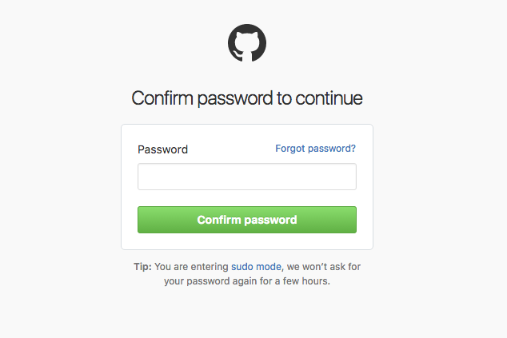
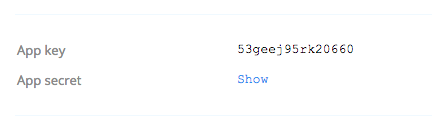

<h1 align="center">The Client ID and Secret</h1>

At this point, you’ve built the application registration screen, you’re ready to let the developer register the application. When the developer registers the application, you’ll need to generate a client ID and optionally a secret. When generating these strings, there are some important things to consider in terms of security and aesthetics.

## Client ID

The `client_id` is a public identifier for apps. Even though it’s public, it’s best that it isn’t guessable by third parties, so many implementations use something like a 32-character hex string. If the client ID is guessable, it makes it slightly easier to craft phishing attacks against arbitrary applications. It must also be unique across all clients that the authorization server handles.

Here are some examples of client IDs from services that support OAuth 2.0:

- Foursquare: ZYDPLLBWSK3MVQJSIYHB1OR2JXCY0X2C5UJ2QAR2MAAIT5Q
- Github: 6779ef20e75817b79602
- Google: 292085223830.apps.googleusercontent.com
- Instagram: f2a1ed52710d4533bde25be6da03b6e3
- SoundCloud: 269d98e4922fb3895e9ae2108cbb5064
- Windows Live: 00000000400ECB04
- Okta: 0oa2hl2inow5Uqc6c357

If the developer is creating a “public” app (a mobile or single-page app), then you should not issue a `client_secret` to the app at all. This is the only way to ensure the developer won’t accidentally include it in their application. If it doesn’t exist, it can’t be leaked!

Because of this, it’s usually a good idea to ask the developer what type of application they are creating when they start. You can present the following options to them, and only issue a secret for “web server” or “service” apps.

- Web-server app
- Single-page app
- Mobile or native app
- Service app

Of course there’s nothing stopping the developer from choosing the wrong option, but by taking the initiative of asking the developer what kind of app the credentials will be used by, you can help reduce the likelihood of leaked secrets.

## Client Secret

The `client_secret` is a secret known only to the application and the authorization server. It is essential the application’s own password. It must be sufficiently random to not be guessable, which means you should avoid using common UUID libraries which often take into account the timestamp or MAC address of the server generating it. A great way to generate a secure secret is to use a cryptographically-secure library to generate a 256-bit value and then convert it to a hexadecimal representation.

In PHP, you can use the random_bytes function and convert to a hex string:

```
bin2hex(random_bytes(32));
```

In Ruby, you can use the SecureRandom library to generate a hex string:

```
require 'securerandom'
SecureRandom.hex(32)
```

It is critical that developers never include their `client_secret` in public (mobile or browser-based) clients. To help developers avoid accidentally doing this, it’s best to make the client secret visually different from the ID. This way when developers copy and paste the ID and secret, it is easy to recognize which is which. Usually using a longer string for the secret is a good way to indicate this, or prefixing the secret with “secret” or “private”.

## Storing and Displaying the Client ID and Secret

For each registered application, you’ll need to store the public `client_id` and the private `client_secret`. Because these are essentially equivalent to a username and password, you should not store the secret in plain text, instead only store an encrypted or hashed version, to help reduce the likelihood of the secret leaking.

When you issue the client ID and secret, you will need to display them to the developer. Most services provide a way for developers to retrieve the secret of an existing application, although some will only display the secret one time and require the developer store it themselves immediately. If you display the secret only one time, you can store a hashed version of it to avoid storing the plaintext secret at all.

If you store the secret in a way that can be displayed later to developers, you should take extra precautions when revealing the secret. A common way to protect the secret is to insert a “re-authorization” prompt before the developer can view the secret.

<p align="center"  style="width:100%">
    <figure align="center">
        
        <figcaption style="font-size:14px;color:#bbb">GitHub reauthorization prompt<figcaption>
    </figure>
</p>

The service asks the developer to confirm their password before it will reveal the secret. This is commonly seen in Amazon or GitHub’s websites when you attempt to view or update sensitive information.

<p align="center"  style="width:100%">
    <figure align="center">
        
        <figcaption style="font-size:14px;color:#bbb">Dropbox 'show secret' confirmation<figcaption>
    </figure>
</p>

Additionally, obscuring the secret on the application detail page until the developer clicks “show” is a good way to prevent accidental leakage of the secret.

[Previous](https:// "Previous")
/
[Next](https:// "Next")
