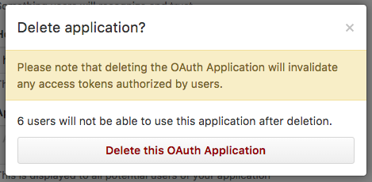

<h1 align="center">Deleting Applications and Revoking Secrets</h1>

Developers will need a way to delete (or at least deactivate) their applications. It is also a good idea to provide a way for the developer to revoke and generate a new client secret for their apps.

## Deleting Applications

When the developer deletes an application, the service should inform the developer about the consequences of deleting the application. For example, GitHub tells the developer that all access tokens will be revoked, and how many users will be affected.

    <figure align="center">
        
        <figcaption style="font-size:14px;color:#bbb">GitHub delete application prompt<figcaption>
    </figure>

Deleting an application should immediately revoke all access tokens and other credentials that were issued to the application such as pending authorization codes and refresh tokens.

## Revoking Secrets

The service should provide the developer with a way to reset the client secret. In the case when the secret is accidentally exposed, the developer needs a way to ensure the old secret can be revoked. Revoking the secret should not necessarily invalidate users’ access tokens, since the developer could always delete the application if they wanted to also invalidate all user tokens.

    <figure align="center">
        
        <figcaption style="font-size:14px;color:#bbb">GitHub reset client secret prompt<figcaption>
    </figure>

Resetting the secret should keep all existing access tokens active. However this does mean that any deployed applications using the old secret will be unable to refresh the access token using the old secret. The deployed applications will need to update their secrets before they will be able to use a refresh token.

[Previous](https:// "Previous")
/
[Next](https:// "Next")
