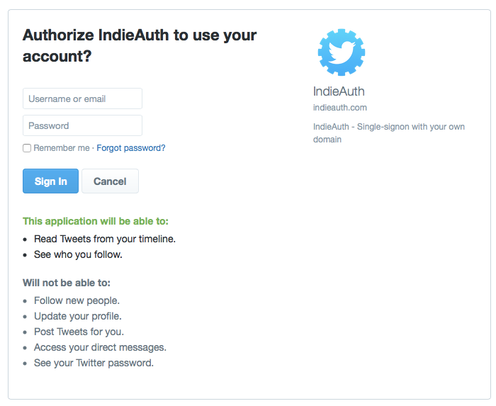
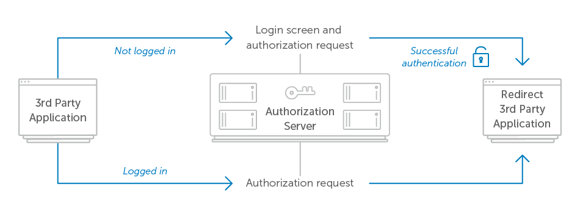
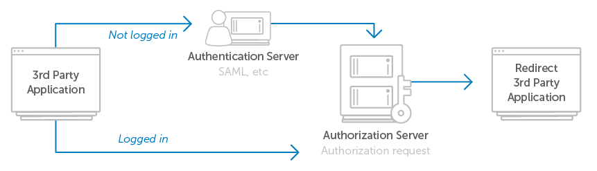

<h1 align="center">Requiring User Login</h1>

The first thing the user will see after clicking the application’s “sign in” or “connect” button is your authorization server UI. It’s up to the authorization server to decide whether to require the user log in each time they visit the authorization screen, or keep the user signed in for some period of time. If the authorization server remembers the user in between requests, then it may still need to ask the user’s permission to authorize the application on future visits.

Typically sites like Twitter or Facebook expect their users are signed in most of the time, so they provide a way for their authorization screens to give the user a streamlined experience by not requiring them to log in each time. However, based on the security requirements of your service as well as that of the third-party applications, it may be desirable to require or give developers the option to require the user to log in each time they visit the authorization screen.

In Google’s API, applications can add `prompt=login` to the authorization request, which causes the authorization server to force the user to sign in again before it will show the authorization prompt.

In any case, if the user is signed out, or doesn’t yet have an account on your service, you’ll need to provide a way for them to sign in or create an account on this screen.

    <figure align="center">
        
        <figcaption style="font-size:14px;color:#bbb">Logged-out view of Twitter’s authorization screen<figcaption>
    </figure>

Authenticating the user can be done any way you wish, as this is not specified in the OAuth 2.0 spec. Most services use a traditional username/password login to authenticate their users, but this is by no means the only way you can approach the problem. In enterprise environments, a common technique is to use SAML to leverage an existing authentication mechanism at the organization, while avoiding creating another username/password database.

This is also the opportunity the authorization server has to require multifactor authentication from the user. After authenticating with the user’s primary username and password, the authorization server can require a second factor such as WebAuthn or a USB security key. The benefit of this pattern is the applications do not need to be aware of whether multifactor authentication is being used or required, since that happens entirely between the user and the authorization server without being visible to the application.

Once the user authenticates with the authorization server, it can continue to process the authorization request and redirect the user back to the application. Sometimes the server will consider a successful login to also mean that the user authorized the application. In this case, the authorization screen with the login prompt would need to include text that describes the fact that by signing in, the user is approving this authorization request. This would result in the following user flow.

    <figure align="center">
        
        <figcaption style="font-size:14px;color:#bbb">User flow for logged-in vs not-logged-in<figcaption>
    </figure>

If the authorization server needs to authenticate the user via SAML or with some other internal system, the user flow would look like the following

    <figure align="center">
        
        <figcaption style="font-size:14px;color:#bbb">User flow for separate authentication server<figcaption>
    </figure>

In this flow, the user is directed back to the authorization server after signing in, where they see the authorization request as they would if they had already been signed in.

[Previous](https:// "Previous")
/
[Next](https:// "Next")
