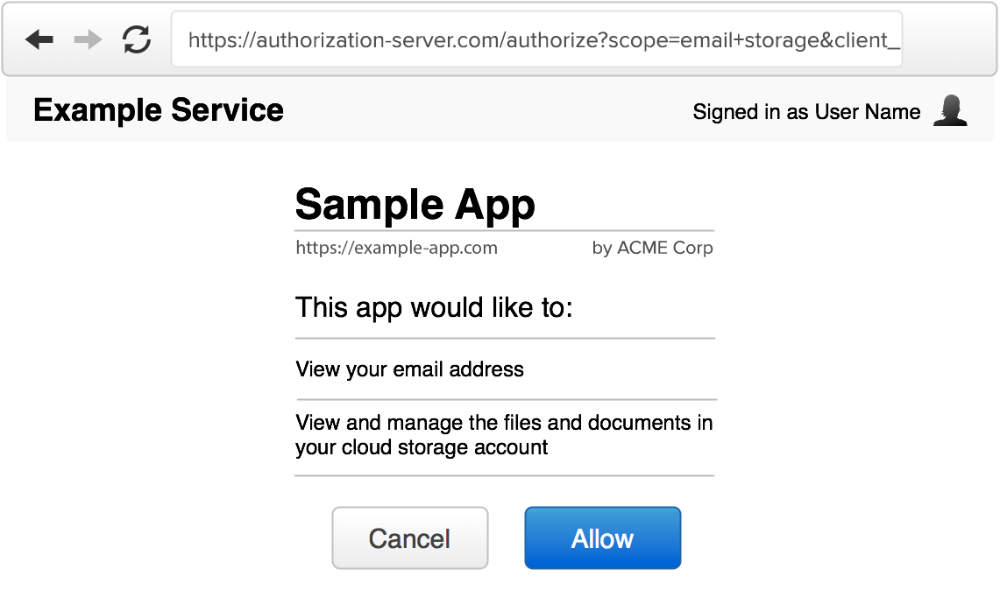

<h1 align="center">The Authorization Interface</h1>

    <figure align="center">
        
        <figcaption style="font-size:14px;color:#bbb">Example OAuth Authorization Screen<figcaption>
    </figure>

The authorization interface is the screen users will see when they are presented with an authorization request from a third-party app. This is often also referred to as the “consent screen” or “permission prompt”. Since the user is being asked to grant some level of access to a third-party app, you need to ensure the user has all the information they need to make an informed decision about authorizing the application.

This is typically only needed when the user is logging in to a third-party application rather than a first-party application. For example, when logging in to Gmail, you wouldn’t expect Google to ask you whether it’s okay for Gmail to know your account info, since both the application (Gmail) and the OAuth server are part of the same company’s product. However if you are logging in to a third-party mailing list application that will send emails from your Gmail account, it becomes critical that you as the user are informed about what this third-party application will be granted access to and what it will be able to do with your account.

An authorization interface typically has the following components:

## Website name and logo

The service should be easily recognizable by the user, since they need to know which service they are granting access to. However you identify your website on your main pages should be consistent with the authorization interface. Typically this is done by showing the application name and logo in a consistent location of the screen, and/or by using a consistent color scheme across the entire website.

## User identification

If the user is already signed in, you should indicate this to the user. This may be something like showing their name and photo in the top corner of the screen, as you would in the rest of your website.

It is important that the user knows which account they are currently signed in as, in case they manage multiple accounts, so that they don’t mistakenly authorize a different user account.

## Application details

The authorization interface should clearly identify the application that is making the request. In addition to the developer-provided application name, it is usually a good idea to show the website and application’s logo as well. This is information you will have collected when the developer registered the application. We discussed this in detail in Client Registration.

The requested scope
The scope values provided in the authorization request should be clearly displayed to the user. The scope values are typically short strings representing certain access, so a more human-readable version should be shown to the user.

For example, if a service defines a scope of “private” to mean read access to private profile data, then the authorization server should say something along the lines of “this application will be able to view your private profile data.” If the scope explicitly allows write access, that should also be identified in the description, such as “this application will be able to edit your profile data.”

If no scope is present, but your service still grants some basic level of access to a user’s account, you should include a message describing what the app will get access to. If omitting scope means the only thing the app gets is user identification, you can include a message to the effect of “this application would like you to sign in” or “this application would like to know your basic profile information.”

See Scope for more information on how to effectively use scope in your service.

## The requested or effective lifetime

The authorization server has to make a decision about how long the authorization will be valid, how long the access tokens will last and how long refresh tokens will last.

Most services do not automatically expire authorizations, and instead expect the user to periodically review and revoke access to apps they no longer want to use. However some services provide limited token lifetime by default, and either allow the application to request a longer duration, or force users to re-authorize the app after the authorization is expired.

Whatever your decision about the lifetime of the authorization, you should make it clear to the user how long the app will be able to act on the user’s behalf. This can be something as simple as a sentence that says “this application will be able to access your account until you revoke access,” or “this application will be able to access your account for one week.” See Access Token Lifetime for more information about token lifetimes.

## Allow / Deny

Lastly, the authorization server should provide two buttons to the user, to allow or deny the request. If the user is not logged in, you should provide a login prompt instead of an “allow” button.

If the user approves the request, the authorization server will create a temporary authorization code and redirect the user back to the application. If the user clicks “deny,” the server will redirect back to the application with an error code in the URL. The next section goes into details of how this response should be handled.

[Previous](https:// "Previous")
/
[Next](https:// "Next")
