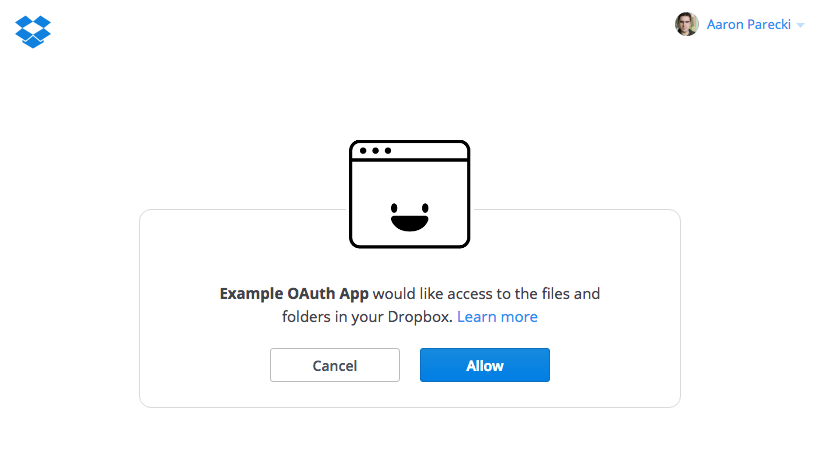
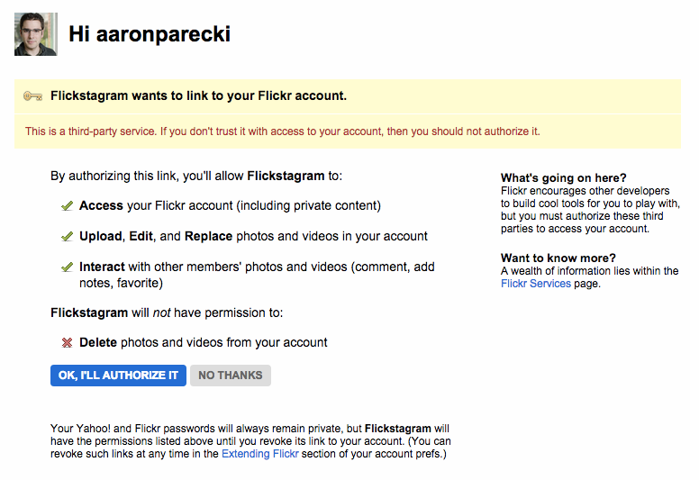
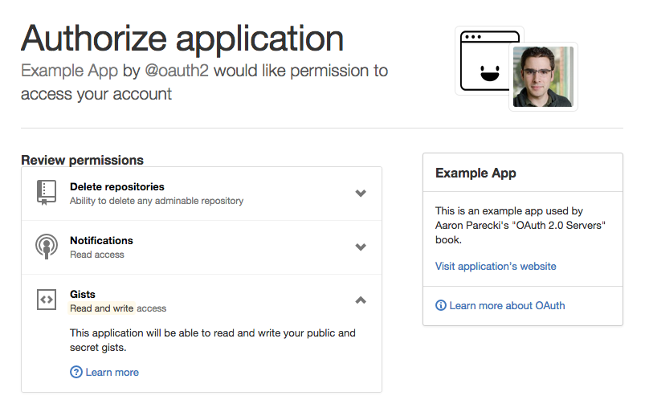
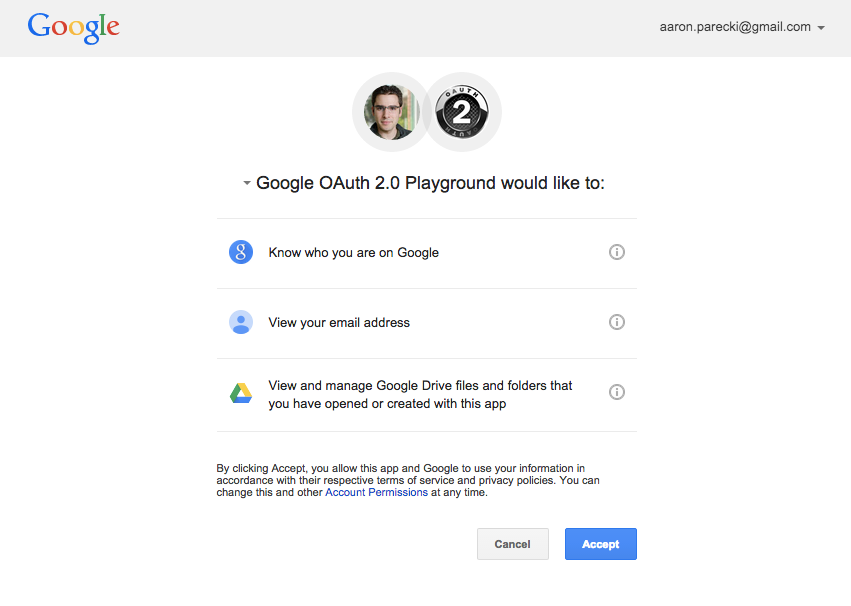
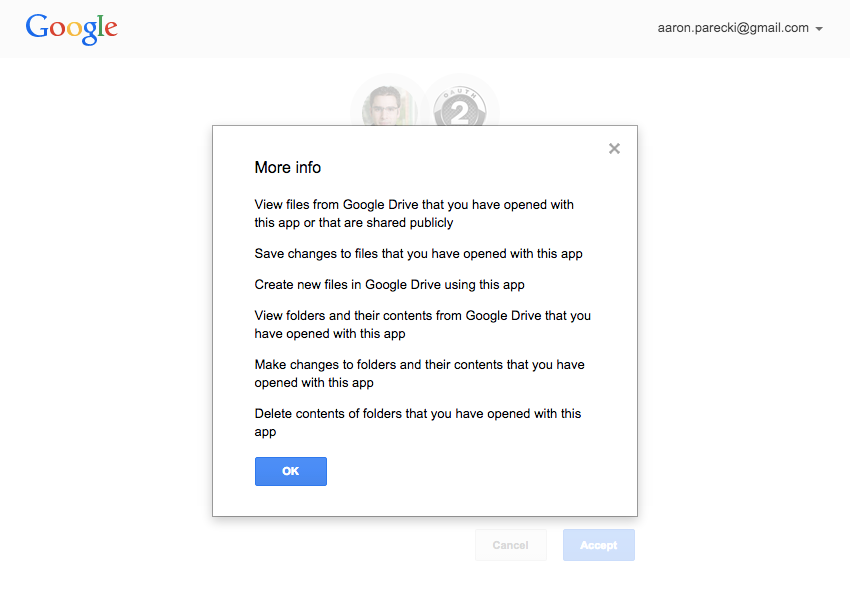

<h1 align="center">User Interface</h1>

The interface that the user sees when authorizing an app needs to clearly display the list of scopes that are being requested by the application. The user may not be aware of all of the possibilities of scopes that the service provides, so it’s best to make this text as clear and straightforward as possible, avoiding jargon and abbreviations.

If the request grants the application full access to a user’s account, or access to a substantial part of their account such as being able to do everything except change their password, the service should make it abundantly clear.

For example, the first sentence on the Dropbox authorization UI is “Example OAuth App would like access to the files and folders in your Dropbox” with a “Learn More” link that links to a help page describing exactly what access the application will have.

    <figure align="center">
        
    </figure>

The Flickr authorization interface shows three things the user is granting to the app when I sign in, and clearly shows permission the app will not have. The benefit of showing this is the user can be reassured the app they’re authorizing won’t be able to do potentially destructive operations.

    <figure align="center">
        
    </figure>

GitHub has done a great job of providing detailed information about the scopes a user is granting. Each scope requested gets a section on the page with the name, an icon, a short description highlighting whether this is read-only or read-write, and a dropdown to see a more detailed explanation.

    <figure align="center">
        
    </figure>

Google has a single authorization endpoint for all of their services including the Gmail API, Google Drive, Youtube, etc. Their authorization interface displays each scope in a list, and includes an “information” icon you can click to get more information about the particular scope.

    <figure align="center">
        
    </figure>

Clicking the information icon presents an overlay that describes in detail what this scope allows.

    <figure align="center">
        
    </figure>

You can see there are a number of ways you can provide the user with information about the scope of the OAuth grant, and various services have taken quite different approaches. Be sure to consider the privacy and security requirements of your application when deciding what level of detail you will include about the scope.

[Previous](https:// "Previous")
/
[Next](https:// "Next")
