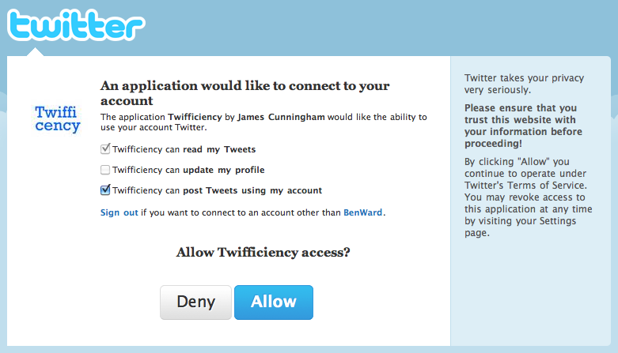
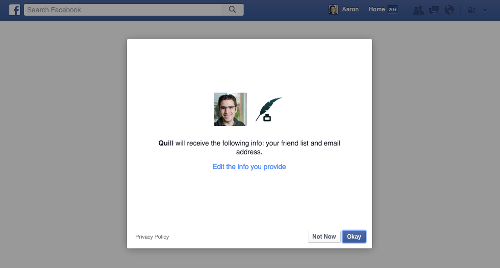
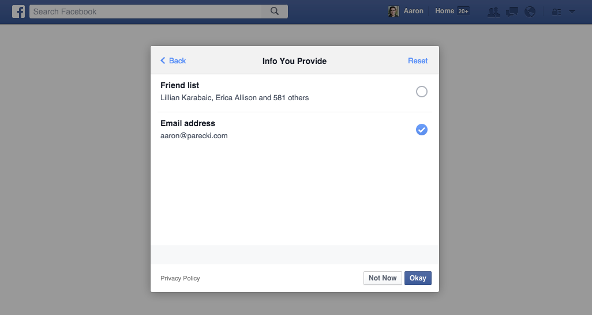
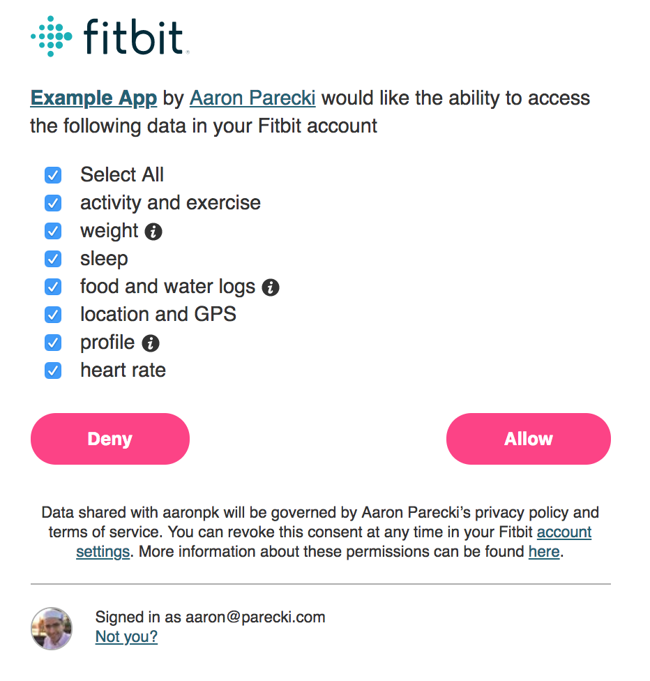

<h1 align="center">Checkboxes</h1>

While seemingly an underused feature, the OAuth 2.0 spec explicitly allows the authorization server to grant an access token with less scope than the application requests. This leaves room for some interesting possibilities.

Before the development of the OAuth 2.0 spec began, OAuth 1 was deployed at Twitter, and the Twitter app ecosystem was growing quickly. When creating a Twitter app, you would choose whether your app needed read+write access or just read access to your users’ accounts. This was a mechanism that led to the development of OAuth 2.0’s concept of scope. However, this implementation was rather limiting, since apps would either request write access or not, and the user might simply reject the request if they did not want to grant the app write access.

There quickly developed a common anti-pattern of Twitter apps that only used the write access to post a tweet advertising the app. One of the more infamous occurrences of this was in 2010, when the app “Twifficiency,” which claimed to “calculate your twitter efficiency based upon your twitter activity” spiraled out of control. You would sign in to the app with your Twitter account, and it would crawl through your past tweets and analyze them. However, it also automatically tweeted out “My Twifficiency score is \_\_%. What’s yours?” with a link to the website. Many people were not even aware the app was doing this, or that they had granted this app permission to post to their account. This caused the app to go viral, since the followers of anyone who used the app would see it in their timeline.

Many people were upset about this, and complained loudly on Twitter. Ben Ward, a developer at Yahoo at the time, went one step further, and created a mockup of a potential user interface that could solve this problem, and wrote a brief blog post explaining it. https://benward.uk/blog/tumblr-968515729

    <figure align="center">
        
    </figure>

In the post, Ward described a user interface that would allow the application to request specific permissions, and the user could choose to grant or not grant each one. This would allow users to sign in to an application but not grant the ability for it to post to their account at first. Later, if the user did want to allow the app to post, the app could provide a mechanism to re-authorize the user on Twitter. Ward was hired at Twitter a few months later.

This post stirred up some discussion among several people involved in the development of the OAuth specs, in a Google Buzz thread which now only exists on archive.org: http://web.archive.org/web/20100823114908/http://www.google.com/buzz/tantek/5YHAAmztLcD/t-Look-BenWard-schools-Twitter-on-OAuth.

To this day, Twitter still does not provide this kind of granular authorization. However, other services have begun to implement similar things, giving the user more control during the authorization flow rather than making it look like a “click OK to continue” dialog.

## Facebook

Facebook supports a variation on this idea by providing a simple UI for the initial screen, but allows users to click to edit the scopes the application will be granted, shown below.

    <figure align="center">
        
    </figure>

If you click “Edit the info you provide”, you are taken to an interface that lists each scope the application requested, and you can un-check them as desired. In the screenshot below, I’ve chosen to not allow the application to see my list of friends.

    <figure align="center">
        
    </figure>

Only the scopes the application requested appear in this list. This provides a better experience for users, since they are able to maintain control and better understand how applications can use their account.

## FitBit

FitBit tracks many aspects of a user’s health, such as step count, heart rate, food and drink consumed, sleep quality, weight, and more. The FitBit API provides access to all this data to third party applications. Because many third-party apps will be reading or writing only certain kinds of data, such as a wifi scale that only needs to write weight entries, FitBit provides granular scopes so that a user can grant access to only certain parts of their profile.

FitBit’s authorization screen, shown below allows the user to selectively grant or deny access to each particular scope that the application is requesting.

    <figure align="center">
        
    </figure>

GitHub has described in a blog post in 2013 that they have plans for allowing users to edit the scopes, however as of 2018, there has been no follow-up.

Giving your users the ability to choose which scopes are granted is a great way to make people feel more comfortable with using third party apps. A checkbox next to each scope is sufficient, or you can move the controls to a separate screen like Facebook. You’ll need to ensure that when you send the access token response, it includes the list of scopes granted if it’s different from what the application requested. See Access Token Response for more details.

[Previous](https:// "Previous")
/
[Next](https:// "Next")
