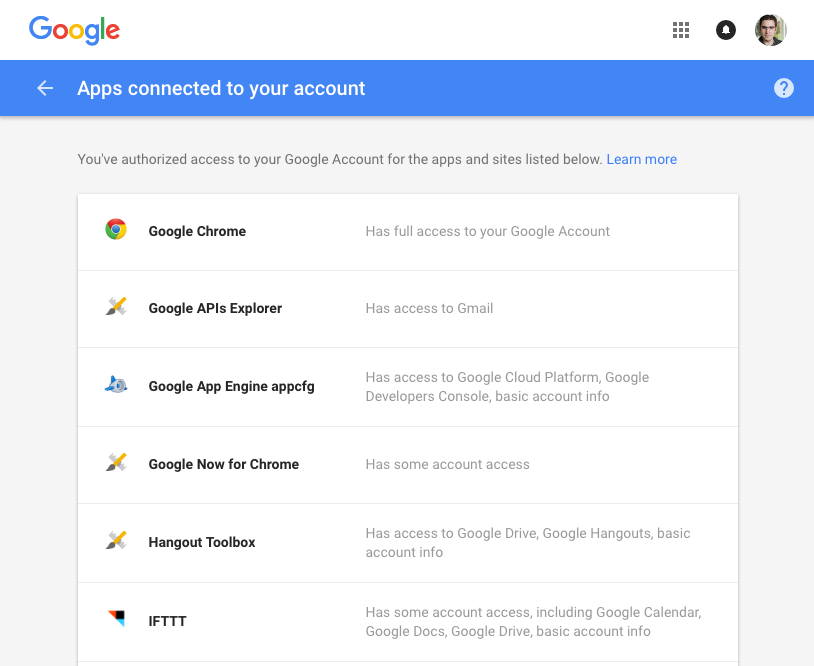
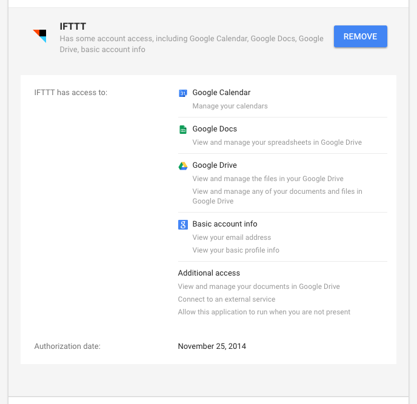
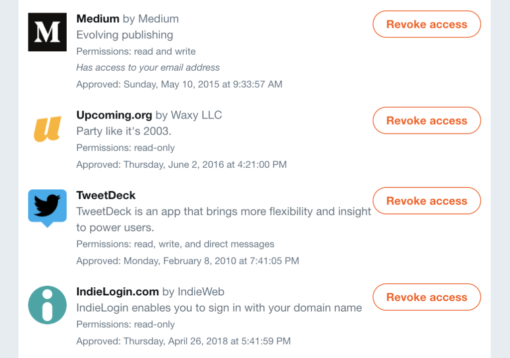
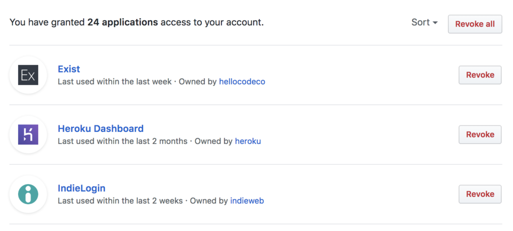
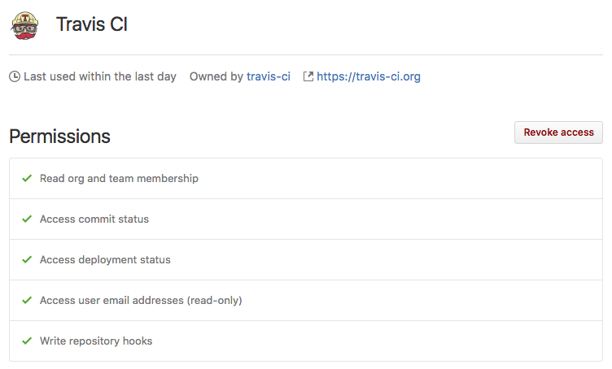

<h1 align="center">Listing Authorizations</h1>

Once users have begun to authorize multiple applications, giving many apps access to their account, it becomes necessary to provide a way to allow the user to manage the apps that have access. This is usually presented to the user in an account settings page or an account privacy page.

There is nothing in the OAuth 2.0 spec that requires users be able to revoke accesss or even suggests how to do this, so instead we’ll look at several major API providers for inspiration on how to accomplish this.

Most providers have a page which lists all applications the user has authorized to their account. Usually there is some information displayed about the application, and information meant to give context to the user about when and why this application has access.

## Google

Google provides a list of applications you’ve authorized on your account at https://security.google.com/settings/security/permissions.

    <figure align="center">
        
        <figcaption style="font-size:14px;color:#bbb">List of applications you’ve authorized to access your Google account<figcaption>
    </figure>

The list shows the application icon, name, and a summary of the scope that the application is granted. Clicking on one of them expands that section to show more details.

    <figure align="center">
        
        <figcaption style="font-size:14px;color:#bbb">Details of one application authorized to access your Google account<figcaption>
    </figure>

This view provides a more detailed list of scopes that have been granted, as well as the date that you authorized the application.

## Twitter

Twitter provides a list of applications you’ve authorized at https://twitter.com/settings/applications.

    <figure align="center">
        
        <figcaption style="font-size:14px;color:#bbb">List of applications you’ve authorized to access your Twitter account<figcaption>
    </figure>

Twitter shows the scope that was granted (read-only, read/write, read/write/direct messasges), as well as whether the app can see your email address. The list includes the date you authorized the application. This makes it easy for users to revoke credentials from apps they haven’t used in a while.

## GitHub

GitHub provides a list of applications you’ve authorized at https://github.com/settings/applications.

    <figure align="center">
        
        <figcaption style="font-size:14px;color:#bbb">List of applications you’ve authorized to access your GitHub account<figcaption>
    </figure>

The list that GitHub provides includes a description of the last time the application was used, to give you an idea of whether you can safely revoke an application’s credentials if it hasn’t been used in a while.

Clicking on an application provides more details about that application’s access.

    <figure align="center">
        
        <figcaption style="font-size:14px;color:#bbb">Details of one application authorized to access your GitHub account<figcaption>
    </figure>

Here you can see the permissions (scope) the application has on your account.

You can find links to other services’ authorization pages here.

## Revoking Access

All of these services provide a way for the user to revoke a particular application’s access to their account. The next section covers revoking access in more detail.

[Previous](https:// "Previous")
/
[Next](https:// "Next")
