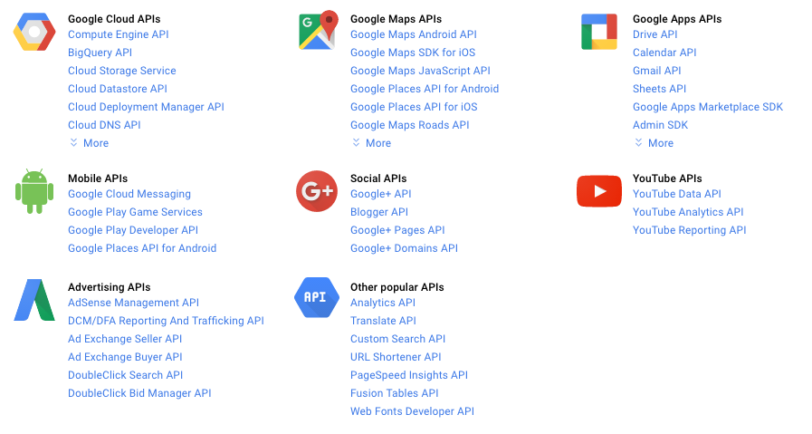

<h1 align="center">The Resource Server</h1>

The resource server is the OAuth 2.0 term for your API server. The resource server handles authenticated requests after the application has obtained an access token.

Large scale deployments may have more than one resource server. Google’s services, for example, have dozens of resource servers, such as the Google Cloud platform, Google Maps, Google Drive, Youtube, Google+, and many others. Each of these resource servers are distinctly separate, but they all share the same authorization server.

<p align="center"  style="width:100%">
    <figure align="center">
        
        <figcaption style="font-size:14px;color:#bbb">Some of Google’s APIs<figcaption>
    </figure>
</p>

Smaller deployments typically have only one resource server, and is often built as part of the same code base or same deployment as the authorization server.

## Verifying Access Tokens

The resource server will be getting requests from applications with an HTTP `Authorization` header containing an access token. The resource server needs to be able to verify the access token to determine whether to process the request, and find the associated user account, etc.

If you’re using self-encoded access tokens, then verifying the tokens can be done entirely in the resource server without interacting with a database or external servers.

If your tokens are stored in a database, then verifying the token is simply a database lookup on the token table.

Another option is to use the Token Introspection spec to build an API to verify access tokens. This is a good way to handle verifying access tokens across a large number of resource servers, since it means you can encapsulate all of the logic of access tokens in a single server, exposing the information via an API to other parts of the system. The token introspection endpoint is intended to be used only internally, so you will want to protect it with some internal authorization, or only enable it on a server within the firewall of the system.

## Verifying Scope

The resource server needs to know the list of scopes that are associated with the access token. The server is responsible for denying the request if the scopes in the access token do not include the required scope to perform the designated action.

The OAuth 2.0 spec does not define any scopes itself, nor is there a central registry of scopes. The list of scopes is up to the service to decide for itself. See Scope for more information.

## Expired Tokens

If your service uses short-lived access tokens with long-lived refresh tokens, then you’ll need to make sure to return the proper error response when an application makes a request with an expired token.

Return an HTTP 401 response with a `WWW-Authenticate` header as described below. If your API typically returns JSON responses, then you can also return a JSON body with the same error information.

```
HTTP/1.1 401 Unauthorized
WWW-Authenticate: Bearer error="invalid_token"
                  error_description="The access token expired"
Content-type: application/json

{
  "error": "invalid_token",
  "error_description": "The access token expired"
}
```

This will indicate to clients that their existing access token expired and that they should try to get a new one using their refresh token.

## Error Codes and Unauthorized Access

If the access token does not allow access to the requested resource, or if there is no access token in the request, then the server must reply with an HTTP 401 response and include a `WWW-Authenticate` header in the response.

The minimum WWW-Authenticate header includes the string Bearer, indicating that a bearer token is required. The header can also indicate additional information such as a “realm” and “scope”. The “realm” value is used in the traditional HTTP authentication sense. The “scope” value allows the resource server to indicate the list of scopes required to access the resource, so the application can request the appropriate scope from the user when starting the authorization flow. The response should also include an appropriate “error” value depending on the type of error that occurred.

- **invalid_request** (HTTP 400) – The request is missing a parameter, or is otherwise malformed.
- **invalid_token** (HTTP 401) – The access token is expired, revoked, malformed, or invalid for other reasons. The client can obtain a new access token and try again.
- **insufficient_scope** (HTTP 403) – The access token

For example:

```
HTTP/1.1 401 Unauthorized
WWW-Authenticate: Bearer realm="example",
                  scope="delete",
                  error="insufficient_scope"
```

If the request does not have authentication, then no error code or other error information is necessary.

```
HTTP/1.1 401 Unauthorized
WWW-Authenticate: Bearer realm="example"
```

[Previous](https:// "Previous")
/
[Next](https:// "Next")
