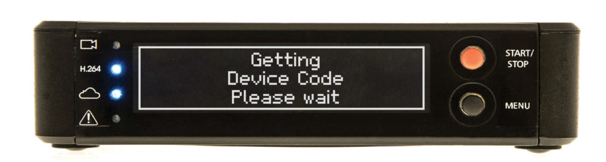
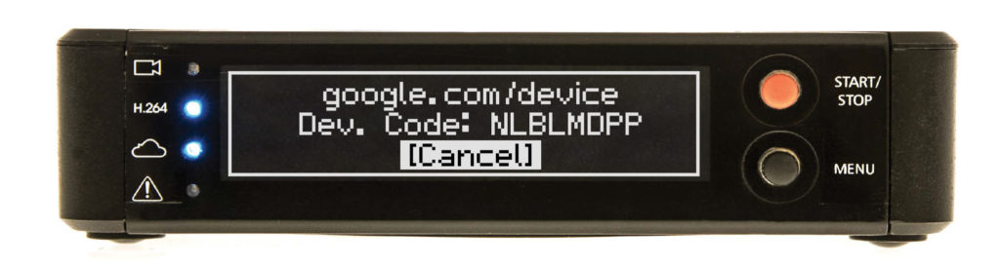
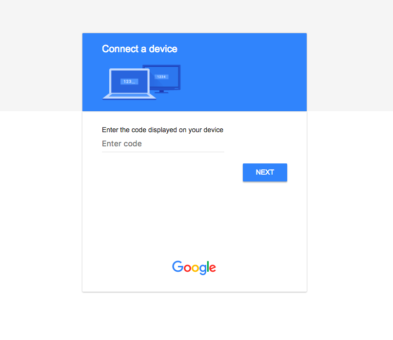
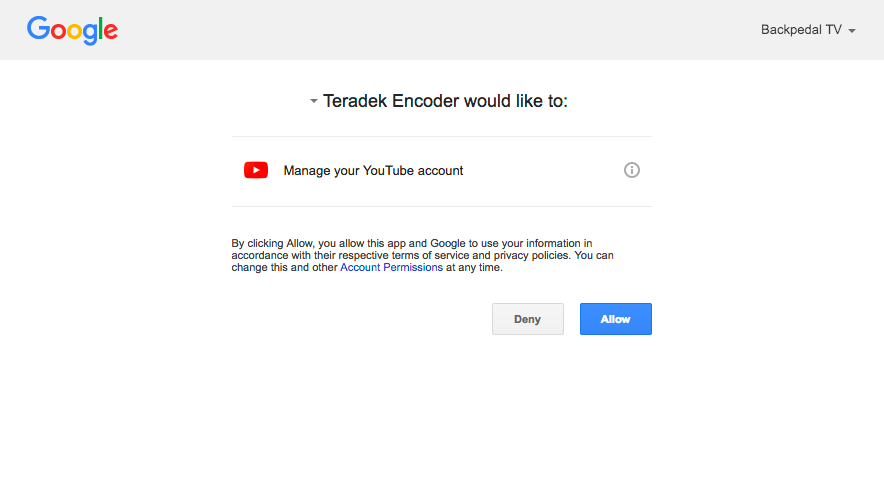
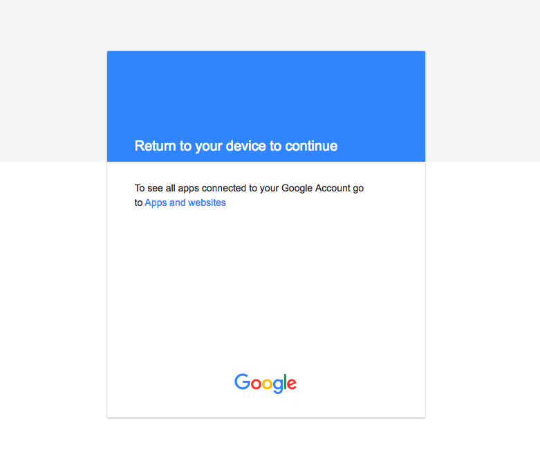

<h1 align="center">User Flow</h1>

When you begin signing in on the device, such as this hardware video encoder, the device talks to Google to get a device code, shown below.

    <figure align="center">
        
        <figcaption style="font-size:14px;color:#bbb">The device making an API request to obtain a device code<figcaption>
    </figure>

Next, we see that the device then shows you the code, along with a URL.

    <figure align="center">
        
        <figcaption style="font-size:14px;color:#bbb">The device displays the device code and URL<figcaption>
    </figure>

Visiting that URL after you’ve signed in to your Google account shows an interface that prompts you to enter the code that’s displayed on the device.

    <figure align="center">
        
        <figcaption style="font-size:14px;color:#bbb">Google prompts the user to enter the code<figcaption>
    </figure>

Once you enter the code and click “Next”, you then see the standard OAuth authorization prompt that describes what scopes the application is requesting, as seen below.

    <figure align="center">
        
        <figcaption style="font-size:14px;color:#bbb">Google displays the scopes the application is requesting<figcaption>
    </figure>

Once you allow the request, Google shows a message that says to return to your device, shown below.

    <figure align="center">
        
        <figcaption style="font-size:14px;color:#bbb">Google instructs the user to return to the device<figcaption>
    </figure>

A few seconds later, the device finishes up and you’re signed in.

Overall this is a pretty painless experience. Since you get to use whatever device you want to open the URL, you can use your primary computer or phone where you’re likely already signed in to the authorization server. This also works with no data entry required on the device! No typing passwords or codes on what is likely a cumbersome tiny keyboard.

Let’s walk through what’s required by the device to make this work.

[Previous](https:// "Previous")
/
[Next](https:// "Next")
