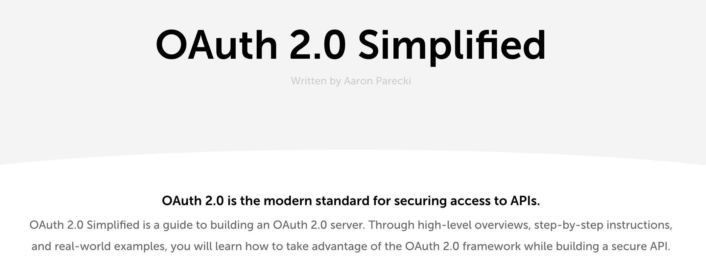

[oauth.com](https://www.oauth.com/) / [start](https://github.com/alithecodeguy/articles/blob/main/OAuth/OAuth%202.0%20Simplified/00%20Background/Background_en.md)

<h4 style="color : red;">
    status : incomplete
</h4>

    

